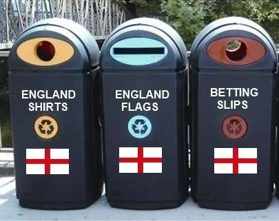

This World Cup, I've been quite surprised to find myself really enjoying the football -- but only when England _lose_. Why is this? What about my native country losing fills me with such schadenfreude?

Dwelling on this, I've come to think that the England football team represents almost all the things I hate about this country.

- First and foremost, we are _the_ great colonial nation. "There is not a country in is World Cup that we, or one of our other European friends, have not invaded, extorted, or enslaved at some point." We are a nasty country, a racist country, a country that has conveniently forgotten almost its entire wealth is based on slavery and exploitation. Being beaten by those we might have _owned_ not so long ago feels like fantastic karmic retribution.

- Following this, it's even more hilarious when foreign players who play for English teams score against us -- Balotelli and Suárez. We invented the sport, sent it out unto the world, and now our incredibly anti-immigrant country can't win without them. We like migrants when they are convenient to our sporting success -- but then treat them like shit.

- This is not a sport that even _pretends_ to be diverse, or care about diversity or equality. There is no concurrent women's tournament, as there is in tennis or athletics. The anchors are almost entirely men, and almost entirely white. Sure, the players donate their match fees to charity, and perhaps this is the most unfair part of this polemic, but this feels like a profoundly obvious PR exercise. Given how much we lose, can the players really accept public cash to buy even more yachts and houses with? It's also very obvious how sanitized the selected good causes are -- nothing with a remotely political stance, or pro-actively anti-discrimination in a famously racist, sexist, homophobic sport. Not even anything related to domestic violence, match day violence, justice for the victims of Hillsborough. Safe, sanitized, baby-kissing charities, that would coincidentally easily make the cover of _Hello!_ magazine.

- Football must be one of the ultimate bastions of neoliberal handwringing. The corruption of FIFA, the drastic rise in domestic violence following England games, the ludicrous salaries, all are forgotten when the event begins. Why is it that any kind of even remotely critical journalism stops when there is a trophy to be won? Why can the pre-match or half-time spots not be about these things?

All this money spent, all this attention given, and we still lose, and miserably too. English football then perhaps the standard bearer for the kind of country UKIP and the Tories think we live in, and them being beaten is sweet revenge.
