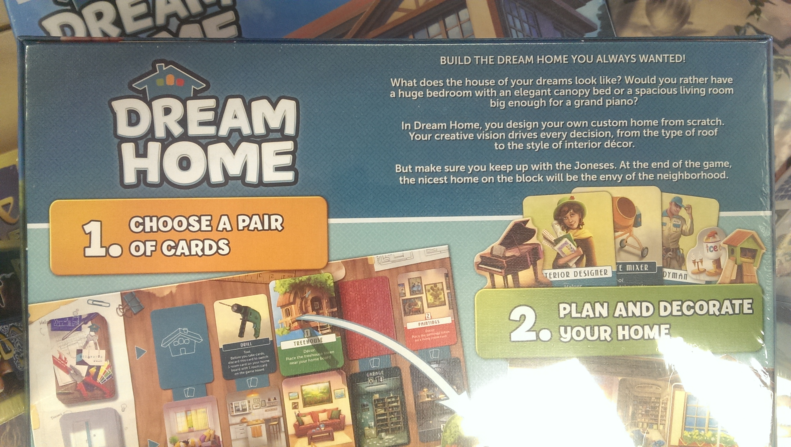
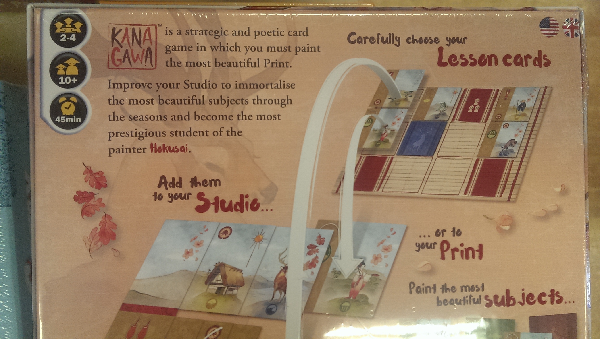
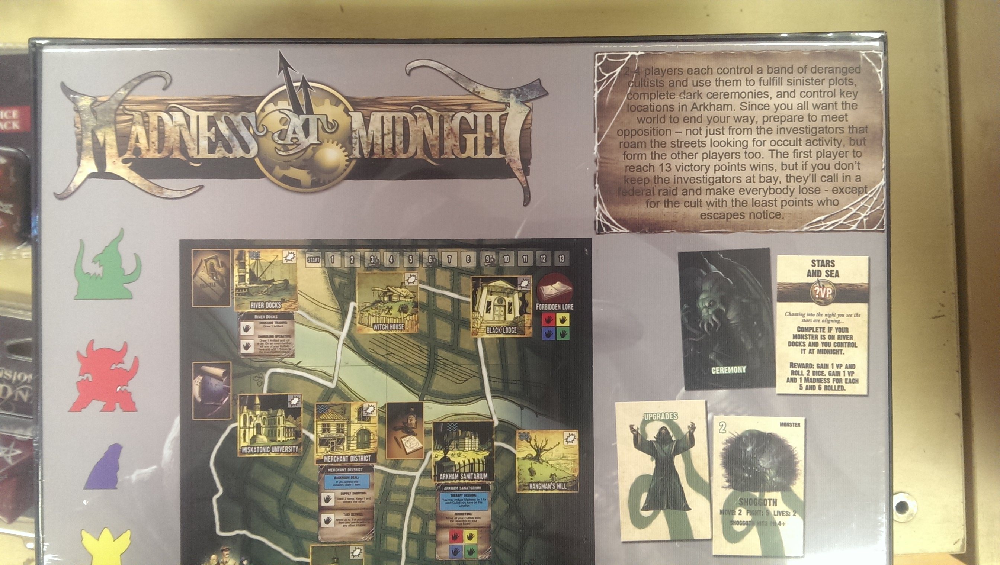
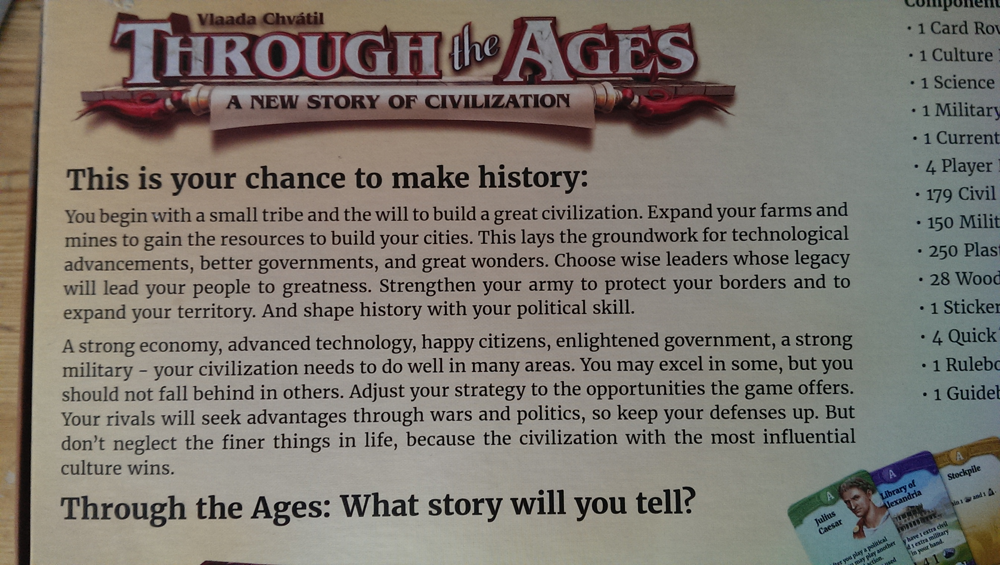

I really hate victory points (VPs) as a game mechanic. Don't get me wrong, I enjoy playing plenty of games that do use victory points. To me though, as a mechanic, they seem like a half-arsed ending for something that didn't know how to finish, like a fade out at the end of a song.

One of my bad academic habits is that when I don't like something, I'm not satisfied with just not liking it, I have to come up with a reason why it's objectively bad. So I started thinking about victory points as a design concept and was pretty surprised to find out that they are actually pretty bad on a number of levels. This article examines what VPs are, ties them into Bourdieu's concept of habitus, and then examines how this potentially links to the game's industry's lack of diversity. I promise it's not as obscure as it sounds!

## So what are victory points?

To start with I'll define what I mean by victory points. I'm not trying to say that using points-based systems in games is bad. I define VPs as **any abstract points system which has no effect on the game apart from to determine a winner**. The abstract concept is important -- I mean here values which have no correlation to a measurable real-life metric like money or land area. The distinctions here are subtle.

For example, one of my favourite games, Suburbia, has a mechanic which looks like VPs -- the winner is the player with the highest population at the end of the game. Population, however, has a direct impact on the way the game plays and forms one of it's core mechanics, giving you negative effects due to bureaucratic inefficiency as it increases -- fundamentally tied into the game's subtly dystopian theme. In addition, of course, population is not an abstract measurement -- but you catch my drift.

Something I wouldn't consider VPs, even though they are called that in the game manual, would be cases like Jaipur. In Jaipur, the points are simply to remember who won a round -- the game is played in other ways, the tokens simply a denotation of another game condition. I also don't consider things victory points which are tangible, measurable things like money, population or territory. These are all things which could reasonably be considered a more grounded objective. I'll explore why this is later on.

There is, as in all things, some ambiguity here. Often VPs are implemented as a kind of "abundance" or surplus value mechanic -- a decision to invest in something extrinsic to the game engine as a sort of showboating mechanic, lets say in a game like San Juan, Race for the Galaxy, or Agricola to some extent. The worst offenders are generally in the "Eurogame" genre, where VPs are frequently the padding on a mathematical puzzle given a thin layer of theme, like Terra Mystica or Le Havre.

I took a quick walk around my local game shop and found a bunch of examples of what I mean.

### Dream Home

> "BUILD THE DREAM HOME YOU ALWAYS WANTED! What does the house of your dreams look like? Would you rather have a huge bedroom with an elegant canopy bed or a spacious living room big enough for a grand piano? In Dream Home, you design your own custom home from scratch. Your creative vision drives every decision, from the type of roof to the style of interior decor. But make sure you keep up with the Joneses. At the end of the game, the nicest home on the block will be the envy of the neighbourhood."

So just like real life, we have an accurate count on who objectively has the best house in the area? Apart from the suggestion that taste is universal, this takes a somewhat interesting (if fairly dystopian and neoliberal) theme and adds on an extremely boring and deterministic end condition.

### Kana Gawa

> "Kana Gawa is a strategic and poetic game in which you must paint the most beautiful Print. Improve your Studio to immortalise the most beautiful subjects through the seasons and become the most prestigious student of the painter Hokusai."

Just like real artists then, you compete for the painting that gains the most points? I know barely any artists who say they care about popularity -- in fact it's almost gauche for artists to publicly appear to try and attain it. It's curious this isn't an exploration of art buying, art school, or the act of painting: to me, much more interesting themes than an economic engine with a shim of art stuck on top.

### Madness at Midnight

> "2-4 players each control a band of deranged cultists and use them to fulfil sinister plots, complete dark ceremonies, and control key locations in Arkham. Since you all want the world to end your way, prepare to meet opposition - not just from the investigators that roam the streets looking for occult activity, but form the other players too. The first player to reach 13 victory points wins, but if you don't keep the investigators at bay, they'll call in a federal raid and make everybody lose - except for the cult with the least points who escapes notice."

While this has a Hearts-style "shoot the moon" victory, again we are treated to a really interesting sounding theme with a snooze-worthy victory condition.

## What do victory points represent, then?

I propose that VPs represent the cultural capital of the player's presumed -- but often absent -- avatar within their own social field. This means that VPs represent the relationship between your game avatar and the other game avatars, not your relationship between your game avatar and the world at large.

In Kana-Gawa what matters is not painting beautiful paintings, or indeed even becoming a rich painter, but gaining the most prestige among artists or collectors. In Dream Home what matters is not having a nice home that you enjoy living in, but having the best house on the block, as decided by the game's creator.

The more you look at these games the more absurd the mechanic becomes. What they are measuring in my view is the generally intangible concept of cultural capital, a concept developed by French sociologist Pierre Bourdieu.

Cultural capital, he says, comes in four kinds: institutional, objectified, social, and embodied. Institutional is the capital we gain from qualifications and certificates we hold. Objectified capital is the prestige we get through nice things we own -- be that a painting from an admired artist, a large record collection, or fashionable clothes. Social cultural capital is the connections and opportunities we gain through our social networks. The fourth type, embodied cultural capital, is more complex. This might be called "performativity" by gender theorists, or "dressage" by Lefebvre -- and refers to that embodied feel we have for certain social situations.

## Understanding the field

Bourdieu recognised that nothing cultural exists in isolation, and rather exists in bounded social areas he calls fields. Board and video games, games players, the games press, games industry, games politics, and games customs are all part of the field of games -- it is a complete and cultural indivisible entity. It is the same in every other field. As feminist academics have been pointing out for decades, everything is subjective and situated within a local, embodied social context that we must understand as a totality that includes ourselves.

Fields also have power relationships with other fields, and relationships within themselves. There are two main types of power: temporal, or economic power; and cultural power. The former dominates the latter economically, while the latter seemingly is where creativity and new ideas come from.

For example, while we might have a few favourite board game designers, if we are not business-oriented it is unlikely we have any favourite board game accountants, managers, CEOs or project managers, even though these people objectively have more power over what gets produced. Bourdieu refers to these individuals as the dominant portion of the dominant class (famous managers) and the subordinate portion of the dominant class (famous designers). In Bourdieu's formulation, life is meaningless and we give it meaning by attempting to gain capital. The rest of us therefore are in a subordinate position, vying to gain access to either of these forms of power.

### Canal Mania

> "In 1776 a short canal was completed between the Duke of Bridgwater's coalmines in Worsley and the growing industrial town of Manchester. So began a transport revolution that saw Britain criss-crossed by over two thousand miles of canals, the work of a vast army of navvy labourers and an elite group of brilliant engineers. In Canal Mania each player employs one of those engineers and attempts to construct part of the canal network. Players are rewarded for building locks, aqueducts and tunnels, and for completing those canals that Parliament gives permission to construct. Further gains are made when transporting goods."

Here's an example that highlights the point I'm trying to get across in this article. Britain's industrialisation is an enormous topic that has changed the face of the world. The introduction of canals transformed our landscape, society, culture and world standing in a plethora of ways, converting Britain from a backwater hinterland to a major economic power.

Instead of exploring any of these concepts, what leads in as an interesting historical theme instead becomes a simple game of who is the best canal engineer, as judged by other canal engineers. This kind of sanitation and Whiggish history is the same kind of narrative told by the right wing as being the basis for what made Britain great. In literary terms, it's regurgitating the ideals of the Daily Mail and it's ilk: that this was a great time, a wonderful time, and one that we should be uncritically proud of.

Here is where VPs become conspicuous in their facilitation of the sanitisation of history. They are measuring the cultural capital within the social grouping of the game actors. The player with the most VPs in Canal Mania is the one who has the highest reputation among canal builders -- not the one who makes the biggest impact on the economy, has the best working conditions, or any number of other interesting historical factors. The field is judged from within, not without -- and in doing so discredits the richness of the game's theme.

I found one game that states this desire for approval among peers explicitly:

### Through the Ages: A New Story of Civilization (2015)

> "This is your chance to make history: You begin with a small tribe and the will to build a great civilization. Expand your farms and gain the resources to build your cities. This lays the groundwork for technological advancements, better governments, and great wonders. Choose wise leaders whose legacy will lead your people to greatness [...] Don't neglect the finer things in life, because the civilization with the most influential culture wins."

Here, the entirety of the game space is simply a pretext for being influential. Implicitly this states that the goal of nation states is simply to produce culture and impact the world -- it is through this impact that we judge success. All other factors in the game -- military, technology, religion, land development, population, ideology -- are simply details through which to generate influence.

## Habitus & Doxa

All this brings us to Bourdieu's concept of habitus. Habitus brings all these things together. It's the "feel of the game" -- our innate feelings for certain situations, our comfort in some environments and our imposter syndrome in others. It's the unspoken social rules that surround an environment.

At Feral Vector (where this article was given as a talk), there was a lot of discussion about imposter syndrome, which illustrates this concept well. When we are in social situations we are not very experienced in, imposter syndrome is a common feeling. We don't know the rules of the game, what's expected, or what people are looking for. This is one of the big factors leads to monocultures -- environments where everyone acts, talks and looks the same, but no-one is quite sure why. This sense of validation that comes from the familiar is what VPs are measuring.

Thing is Bourdieu is kind of a wanker and deliberately writes impenetrably. His own work is a great illustration of this. Bourdieu says habitus is:

> "[s]ystems of durable, transposable dispositions, structured structures predisposed to function as structuring structures, that is, as principles which generate and organize practices and representations that can be objectively adapted to their outcomes without presupposing a conscious aiming at ends or an express mastery of the operations necessary in order to attain them..."

In phrasing it like this he is trying to evoke imposter syndrome. He's using a word that almost sounds like something you know about -- but then using this kind of super-technical sentence structure to give you the feeling that this isn't for you.

The key part I want to focus on in this mammoth definition though is structured structures. Habitus is something acquired from birth through every interaction we have, and it's why people can simply seem posh, poor, working class, or any other number of things simply on meeting them. Habitus is structured by itself -- this is essentially how cliques and in-crowds form, and it's how things like office culture emerge. It's also structured by doxa.

Doxa is the social layer of things which are taken for granted; rules we simply accept. We don't really question that it's (say) Tuesday, or that the American president (at time of writing) is Donald Trump, as much as we may dislike him. It's also the myriad of paperwork, qualifications, certificates and official documents that fill our lives. We accept that a degree from Oxford gives one a claim to a certain kind of intelligence, or that a criminal record makes someone a criminal, even if we disagree with the social institutions that determine these things. In other words: doxa is the rules that govern us.

Rules are something utterly central to gaming as a hobby. We might get angry at dice rolls or, god forbid, try to cheat; but in getting angry or trying to cheat we are accepting the rules as unimpeachable. We might change rules over multiple games, in a group -- but generally for the sake of fairness and fun, using a mediated system that could be seen as rules in itself. Rules structure the game, and through it structure our behaviour around it.

## Privilege loves rules

To the enduring white, middle-class, younger, cisgender, straight, male, ablebodied demographic in gaming, rules work really well. The systems of law, education, government, media, and gaming industry represent and support their needs extremely well. Privilege is fundamentally rooted in having access to a huge array of cultural status symbols and embodied cultural capital that simply makes life easier for ourselves. Many have compared gender or race privilege to playing games on easy-mode, where others play on hard or near-impossible; in theory we can all access the same results, in practice the cost to get there is much higher.

Diversity is often looked at in many sectors including gaming and technology as something to do as an afterthought -- something purely about a presumption of creating safe atmospheres. I'm arguing that, "without presupposing a conscious aiming at ends or an express mastery of the operations necessary," the diversity problem could be rooted in the themes and mechanics of our games in much deeper ways than we realise.

If current game design principles reward creating games that blindly insist on abstract systems of cultural accounting, using VPs to sanitise some of colonialism's worst atrocities, is it any wonder that the cultural circles that surround them will be people for whom this system has benefited? As long as game designers avoid dealing with contentious topics, recycling the same over-done themes on top of business and accounting simulators, is it any wonder that people who don't fundamentally like archaic systems of rules might avoid them? I contend that not only are designers missing out on a wealth of design inspiration and ideas, they're also actively making board gaming less diverse across multiple scales by facilitating an ideological monoculture.

## Summary

I should be clear: I'm not suggesting for a moment that VPs are inherently racist, or that gaming mechanics are the sole or main cause of gaming's limited demographics. I'm suggesting that a serious attempt to understand it must be complete in it's approach, and take things as taken-for-granted as game mechanics into account. I'm saying that VPs are one of the many mechanics that allow history to be sanitised for the sake of making entertainment out of some of colonialism's worst atrocities.

I am saying there needs to exist a greater critique and challenge of colonial presumptions in games. God perpsective. The obviously crass, I would argue racist, oversimplification of games like Puerto Rico are the extreme cases here: one of the greatest crimes of humanity reduced to a system of accounting for who can be the best slave master. I use this game as an example a lot as I think it sums up so much of the problem with the trope. In Puerto Rico VPs are at their most abstract and most damaging.

What would a post-colonial Puerto Rico look like? In a talk I did here the year before last (it's on my blog), I looked at how Phil Eklund's Pax Porfiriana is one route: placing you directly in the shoes of an extremely morally dubious or outright racist protagonist.

Aside from historical simulation though what other routes are there? A few thoughts.

## Mechanics to try

**Games which don't require learning many rules to start with.** This can be done with built-in tutorials, or having rules only needing to be looked up as they become relevant. Vlaada Chvatil is very good at this -- games like Space Alert and Galaxy Trucker have tutorials in the manuals -- which are in themselves fun reads laid out like a trainee handbook. By making the rules explanation part of the game narrative, it makes the act of learning the game feel like a collaborative and fun exercise rather than a government policy briefing.

**Games where the rules are changed** or invented by players as the game goes on. The card game Mao is a classic example of this theme, with the rules being hidden at the start of the game then introduced, silently, every round -- the game shows that finding out hidden rules and trying to remember them is enough material in itself. If you've not played Mao you should really give it a go.

**Games without a winner, or several victory conditions and multiple winners.** Civilization (the board game) does this brilliantly -- allowing technology, military, culture or economic victory (similar to the video game). The Sierra Madre Games Pax trilogy all do this. Having multiple winners isn't something I've seen at all though outside of co-op settings and I think this would be a really interesting mechanic to try.

## Themes to try

**Games that fully take in a historical context** and look at progress from without: the transatlantic slave trade's global impact, for example. Absolutes like explorations of money, territory and political power are rich themes barely touched directly.

**Move away from Western perspectives** on colonial history, working with people oppressed by colonialism, and people involved in political resistance. Manchester, where I live, is the birthplace of many radical social movements from co-operativism to women's sufferage to unions and the Labour Party, with events like Peterloo being instrumental in it's history. I've never seen these themes intelligently looked at in games -- one game from 100 years ago highlights the lack of this kind of thing today.

**Games where people are in different social fields**, judging social conditions in different ways. Linked to the idea of different victory conditions is the idea of different victory themes -- in any real-life situation across social boundaries, people have radically different ideas of success. The core idea that players are competing in a war with a single win condition, or to be the dominant cultural influencer is extremely limiting.

---

I hope this article gave an insight into what I think is an enormous blindspot in boardgame design. Victory points often work by collapsing complex social relationships down to a single metric, and in doing so sanitise history to the point where it becomes unrecognisable. While a few games have done historical themes justice, in general history is used as a thin shim over a game engine that bears no relation to reality.

By making mechanics responsive to themes rather than vice versa, there is enormous potential for genuinely transformative works that explore ways of being -- and even what it means to win.
