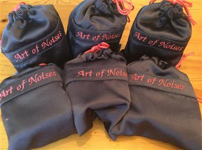

### A game exploring how we communicate using sounds by Dr Kim Foale (2014)

Art Of Noises is a game of abstract musical performance for 3-5 people. Players take the role of avant-garde performers, attempting to communicate various nouns, verbs and adjectives using a variety of toy instruments. Each player takes it in turn to select a card and perform the word on it. The other players guess which word is being performed. At the end of the game, the person with the most points wins, and is declared the most avant-garde.

Art Of Noises is based on my research into the sociology of listening, and is an opportunity to explore how we communicate through sounds. It channels John Cage's passion for experimentation, chance, and his open-definition of what music is, and explicitly makes the players performers in their own scratch orchestra. It's also an attempt to question who is a performer, and encourage a return to more aural sensibilities. [I've written a lengthy post about the rationale behind the game, if you want to know more](/writing/why-art-of-noises).

The game is available under a [Creative Commons BY-NC-SA license](http://creativecommons.org/licenses/by-nc-sa/4.0/) - in other words, it's free to use, alter and share if you're not using it commercially.

## Downloads

To make your own copy, simply print off the rules and cardsheet below. I recommend printing the cardsheet on thin card, and the rules double sided if possible!

### Rules

<iframe src="/kim.town-v2/downloads/rules.pdf" width="100%" height="600px" style="border: 1px solid #ccc; border-radius: 8px;"></iframe>

<a href="/kim.town-v2/downloads/rules.pdf" download style="display: inline-flex; align-items: center; gap: 0.5rem; padding: 0.75rem 1.25rem; background: #5e3538; color: white; text-decoration: none; border-radius: 6px; font-weight: 500; margin-top: 1rem;">
  <svg width="18" height="18" viewBox="0 0 24 24" fill="none" stroke="currentColor" stroke-width="2" stroke-linecap="round" stroke-linejoin="round"><path d="M21 15v4a2 2 0 0 1-2 2H5a2 2 0 0 1-2-2v-4"/><polyline points="7 10 12 15 17 10"/><line x1="12" y1="15" x2="12" y2="3"/></svg>
  Download Rules (PDF, 123KB)
</a>

### Cardsheet

<iframe src="/kim.town-v2/downloads/cardsheet.pdf" width="100%" height="600px" style="border: 1px solid #ccc; border-radius: 8px;"></iframe>

<a href="/kim.town-v2/downloads/cardsheet.pdf" download style="display: inline-flex; align-items: center; gap: 0.5rem; padding: 0.75rem 1.25rem; background: #5e3538; color: white; text-decoration: none; border-radius: 6px; font-weight: 500; margin-top: 1rem;">
  <svg width="18" height="18" viewBox="0 0 24 24" fill="none" stroke="currentColor" stroke-width="2" stroke-linecap="round" stroke-linejoin="round"><path d="M21 15v4a2 2 0 0 1-2 2H5a2 2 0 0 1-2-2v-4"/><polyline points="7 10 12 15 17 10"/><line x1="12" y1="15" x2="12" y2="3"/></svg>
  Download Cardsheet (PDF, 6.6MB)
</a>

## Buy a copy?

I have a limited run of five copies for sale. Each copy contains 192 cards, and is in a hand-made, embroidered bag. Please email [kim@gfsc.studio](mailto:kim@gfsc.studio) if you're interested.

They are £25 plus postage and packing. Please note you need to supply your own instruments!

