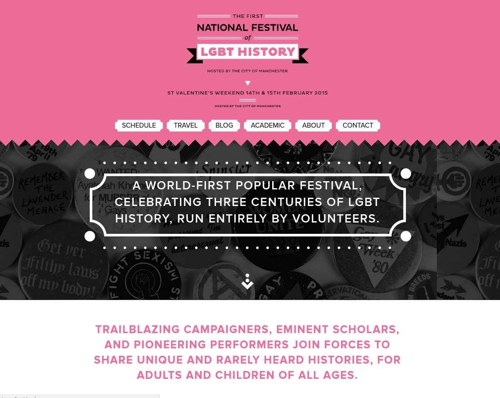
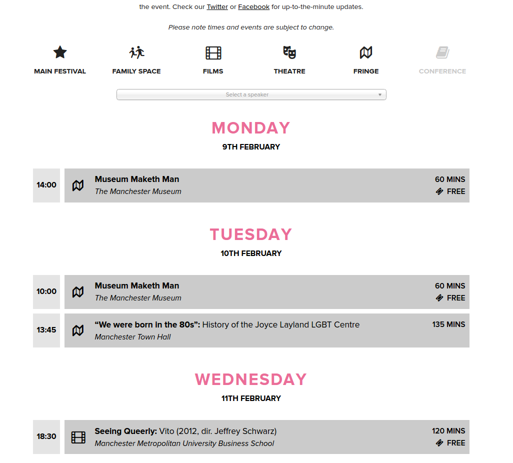

As Communications Director for the First National Festival of LGBT History, I built this site and wrote all copy and communications. This was a huge and engaging volunteer job that took over all my free time for a year or so.

[Check out the First National Festival of LGBT History now.](http://lgbthistoryfestival.org/)

Here's a screenshot of the homepage but you really need to browse it, we spent a lot of time spacing out content so it doesn't translate well to a still.

I knew I would be approving and publishing all the content for this site, so I built it in a static site generator called [Middleman](https://middlemanapp.com/). Static site generators have a lot of benefits, but the main ones for this project were the hackability - I was able to custom code in anything we needed to be responsive to the shifting festival aims.

The main technical challenge for this site was around the calendaring. With 8 volunteers organising getting on for 100 events over a lot of sites, it was important to have something that could be edited quickly and let people find events of interest. I looked at a few commercial and open-source solutions, but none of them really did what we needed, or were hopelessly overpriced. To the drawing board!

I built this solution with [Phoebe](http://queenp.uk/) that uses Google Calendar as a backend. Each of the 6 categories shown here (main festival, family space etc.) are downloaded as an ICS file and then converted into HTML using a Ruby parser. Ticketing information and the like was then parsed from YAML data stored in the event listings. This solution worked like a dream for developers and attendees alike, and I've still not seen anyone else publish a better festival calendar! You can [play with the archived site](http://lgbthistoryfestival.org/schedule.html) or check out the [source on GitHub.](https://github.com/kimadactyl/lgbthistoryfestival)

I'm no longer involved in this festival but the 2015 site is still up to browse.

**When:** April 2014 - February 2015
**Tech:** Middleman, Github Pages, Google Calendar, custom calendar code
**Who:** Kim Foale (build, copy, management), Mark Dormand (design), Phobe Queen (calendar development and editorial assistance)

[Source on GitHub](https://github.com/kimadactyl/lgbthistoryfestival)
