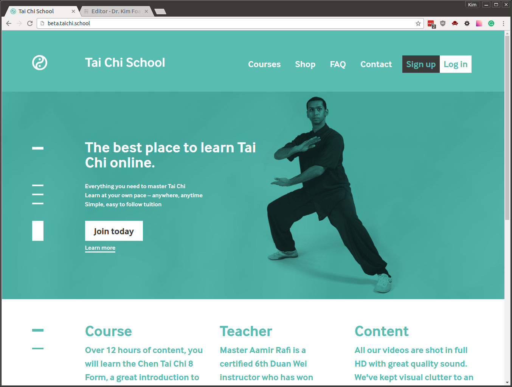
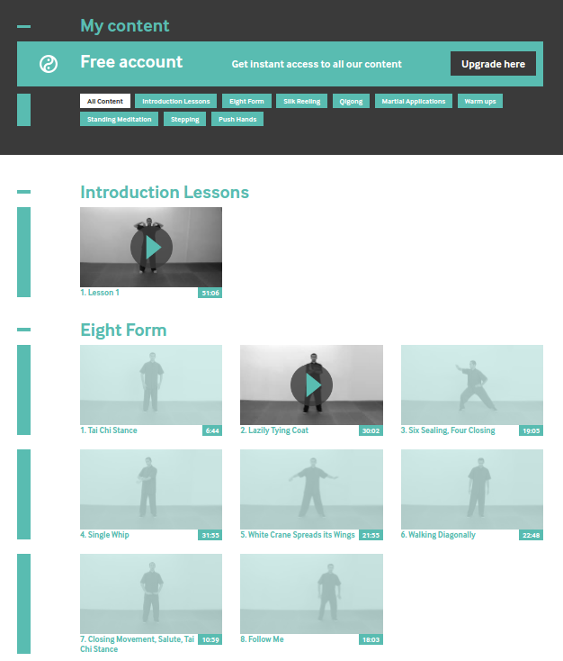
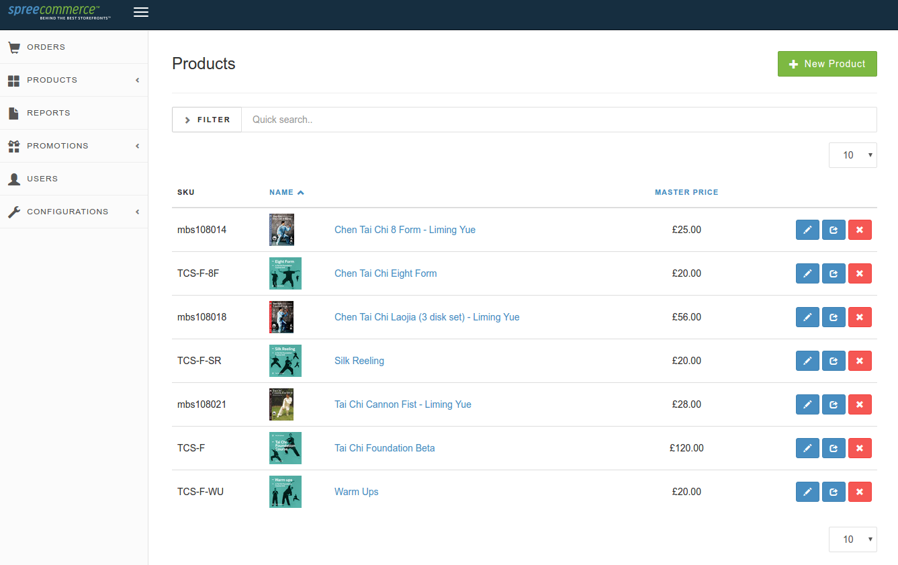

Beta website for my own business, Tai Chi School, which offers the best Tai Chi tuition online. After doing so many client sites, it's been nice to work on my own project.

[Visit taichi.school now!](http://taichi.school/)

The site's my first commercial one in Ruby on Rails, and uses [Spree](https://spreecommerce.com/) for the shopping cart functionality. I initially used Foundation for themeing but found it a poor fit for the site, and have now shifted over to Susy grid system for responsive layouts.

Our market research interviews indicated that people wanted lifetime access, but lots of detail. So we set about making a course that's about 12 hours long.

The main complexity with this site is having an access system for what is soon to be hundreds of videos. Other sites I reviewed had "all or nothing" approaches - either monthly memberships to access everything or one-off payments for the lot.

The dashboard shows the complexity of the system: this is how an unregistered account looks, showing the free content and making it easy to see the site at a glance.

Access control is done using a tiered system (Courses > Units > Lessons), using Spree hooks to assign ownership to users after purchasing things in the store. I might do a writeup of this at a later date. I used ActiveAdmin for the admin functionality.

This site's been a great challenge: I've learnt about video production and editing, Lean Startup ideas, and had some great business support. We're aiming to launch the site properly in August.

**When:** Winter 2015 - now (still in development)
**Tech:** Ruby on Rails, Spree, Susy, ActiveAdmin
**Team:** Kim Foale (development), [Mark Dormand](http://studiosquid.co.uk/) (design)
**Site:** [http://taichi.school/](http://taichi.school/)
