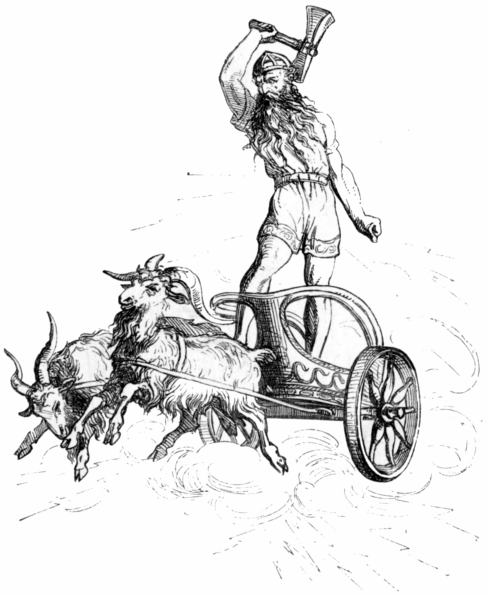
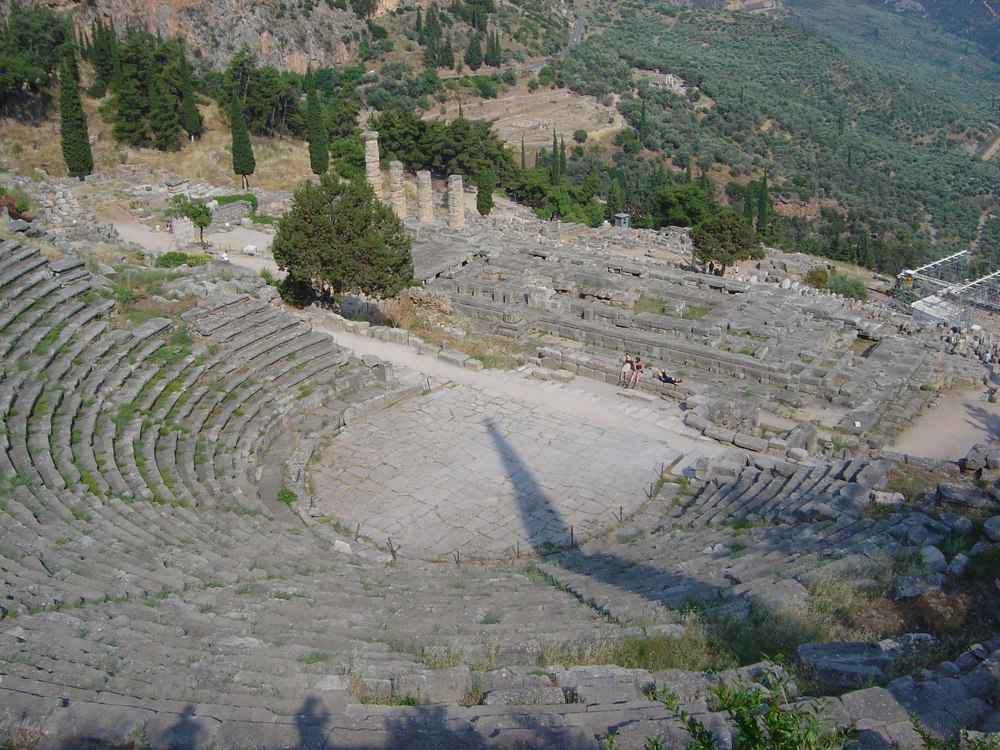
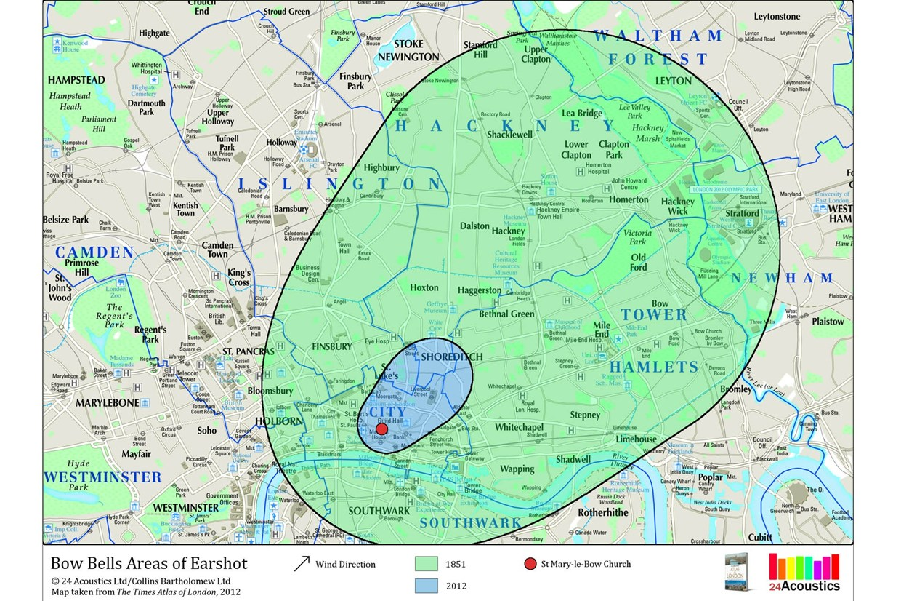
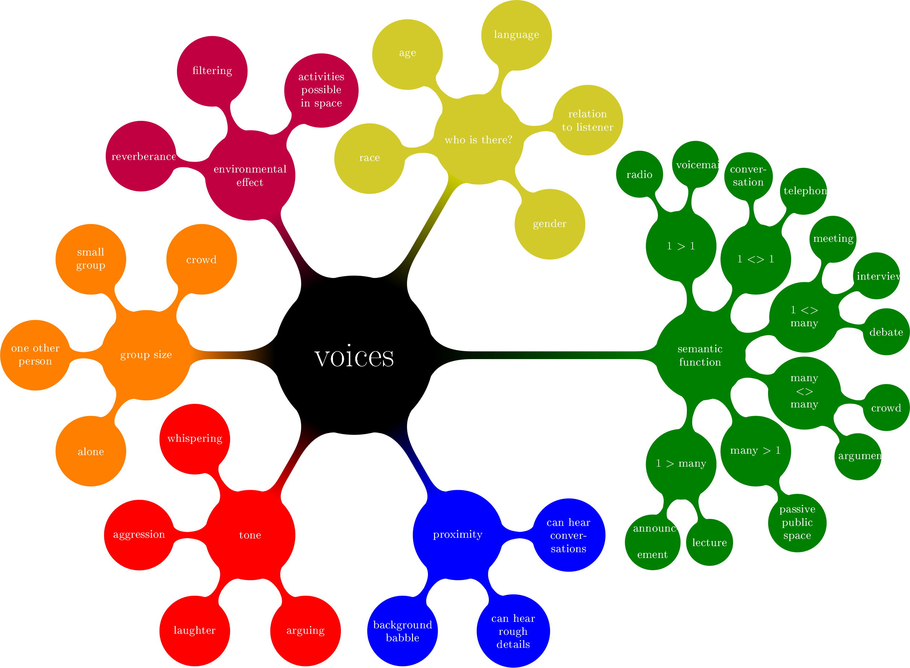
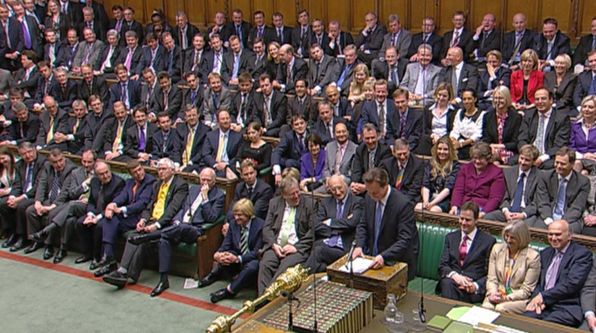

In this article I'm going to talk about how both the ability to create sound and the ways that we hear it are bound up in social power: affected by gender (on an inter-personal level) and patriarchy (on a political level).

The first part will have a historical focus. I'm going to talk about how noise is irrevocably linked with social power, or how the ability to create the loudest sounds is the privilege of the most powerful.

The second part will be more personal. I'm going to talk about how this could affect us on an inter-personal level and how as with all aspects of personal performance, both listening and making sounds is gendered.

### Foundations

Who can create the most sound in any society?

#### Gods

The answer to this question used to be a lot more clear-cut. Gods, or God, or any other concept of divine being, had the ultimate ability to create the loudest sounds.

The _word_ of the divine was before all things. There is perhaps not a more literal version of this than John 1:1: "In the beginning was the Word, and the Word was with God, and the Word was God". From volcano eruptions similar to the explosion of Krakatoa in 1883 to the Norse belief that the sound of thunder was Thor's chariot being pulled by astral goats, sounds were the first site of divine power, which gods were able to wield in unimaginary quantities.

Modern contexts have scientific answers for these phenomena, but even so, in Western science, the Big Bang fills a similar role: in the beginning was nothing, and then there were sounds before all else.

Nowadays, we are used to the _visual_ being the primary sense – this was not always the case. Societies, language and literature in general used to be far more aurally-focussed, before various innovations in printing processes made the visual the primary sense. For example, Plato's Republic limits the size of an ideal society to 5,040: in his time, the number that can be conveniently addressed by a single orator. This level of both environmental quiet and oratorial skill seems difficult to imagine today. Oration, mnemonics and rhyme were the primary carriers of plays, poems, philosophy and ideas, and designed to be easy to remember. The written page was secondary, and few were literate.

Equally, in response to the almighty sound of God or gods, silence has been seen as next to godliness, from places of worship to the lifestyles of groups such as monks and nuns. Silence is holy, divine, and sacred.

#### Kings

People in positions of power have always been keenly aware of the power that sounds hold, even if they do not directly wield them. In a direct sense, imagine the sound of the construction of the Pyramids, the sounds of an army, especially cavalry, on the march, or any other scene of hundreds or thousands being ordered to do the same thing.

Religious officials have a similar use of sound: Christian religions use church bells, Islamic religions a muezzin. The result is the same: the daily reminder of God. Only religions which convert use sounds: Judaism and Hinduism do not, for example. The power is literal: where religious influence starts to wane, so too does the control of the clergy over bellringing – for example, Alan Corbin wrote an entire book on the politics of control over church bells in early 1900s rural France as power shifted from the church to newer atheist sensibilities. It's much less boring than it sounds!

In an indirect sense, after technologies relating to sanitation and water supply allowed humans to live close together in cities, imagine similarly the power city planners, financiers and officials have to direct social development, and with it the sounds of humanity. The dawn of ironworking, cobbled roads and people living in close proximity would enormously increase the volume level: centres of industry and civilisation are also centres of noise, in a literal sense. The afterforementioned bells were less useful as these new noises took over.

#### Capitalists

Come the Industrial Revolution, and the growth of capitalism, feudal power subsides. Now the _richest_ people can create the loudest sounds, on a level not heard before. Whereas pre-industrial noises are (individually at least) intermittent, percussive and rhythmic, industrial ones are consistent, insistent hum at a much broader range of frequencies (broadband noise): sounds of machines rather than sounds of humans. Before, sounds are created by physical processes – hammer on anvil, hooves on cobbles. Now, volume is created by _fuel_, the humans simply existing to operate the machines.

### Performance

Noise then, historically at least, is a literal and direct function of social power until at least the 20th Century. Nowadays, while it is a lot more complicated, there are still a lot of similarities: noise however is no longer a direct requirement of capital growth, and in fact something that increasingly is socially frowned upon. Despite the reduction of individual noises, and a plethora of noise regulation, comes an introduction of air conditioning, air travel and traffic: overall, background levels rise about 6dB per decade and show no sign of slowing.

I'll now talk about the more subtle side of sound production: not just the volume, but a more qualitative side of sound production.

#### Modern social contexts

Orchestras have long been used as symbols of state power. Before the 18th century in the West, court musicians were more seem as domestic servants rather than creatives such as playrights or poets in their own right – commanded to make noises when his lord commands. JS Bach is credited as one of the first musicians in a Western context to be free to compose as and when he wished, on a retainer, by the now forgotten Count Anthon Guenther. Musicians began to get credited as specific authors of works.

Jumping forwards a few hundred years, this kind of patron-sponsored music, where the creative control was shifted more back to the composer as long as it remained pleasing to the commissioner, is still a very powerful idea today as seen in talent shows such as _The X-Factor_. The funding that goes into classical, and especially opera productions, proportionally far, far outweighs the audience for those concerts compared to say, jazz or rock music. It is fair to say then, that the state has a taste, a tradition: a way of listening. What we like is learnt, to a degree, and informed by state desires. In other words: listening is socialised. Both in terms of music and gender roles, what is normal to one society is anathema to another.

#### Performance

How does all this relate to gender?

Butler is commonly credited as the origin of gender performativity, but is curiously short on specifics. A book in the same year by Henri Lefebvre, _Rhythmanalysis_, gives us a different way of describing the same thing – dressage. Much like horses are broken in and made to conform to human expectations, so are humans ourselves – we learn different dressage patterns based on age, gender, race, sexuality, and a myriad other things, that are sometimes conscious, sometimes not, but always socialised.

We are probably all very used to thinking of gender on a theoretical, and a visual level. There is some awareness of gender on a sound level – as anyone who's tried to pass as a different gender before knows well, voice can be one of the hardest elements to crack. I've had dozens of times where I've been read as a woman, then immediately apologised to when I open my mouth – interesting judgements from both sides! There is a huge number of ways we can categorise voices: from function to tone to mode.

Note that these performances are not always solitary. Being in a football crowd, or indeed attending any sporting event, a bar, club or gig, are performances too. How we show our support of things is vocal as much as anything else. Again, listening and performing are in sync.

There is a lot more to an individuals' sound production than their voice though! Lets think about some examples.

#### Sounds of the body

##### Body sounds

Some sounds of the body are gendered, some less so. Bodies make a lot of sounds!

- **Footsteps** can be an overt sign of gender: high heels. Other shoes less so: trainers, barefoot, court shoes, boots.
- **Respiratory and oral** breathing, nose and mouth, sneezing, sniffing. Swallowing, moving lips, utting, coughing. Here, restraint is feminine and overt creation of bodily noises is gendered masculine.
- **Clothing** jewellery, fabrics brushing.

##### Technological sounds

We also augment our bodies with technology.

- **Personal stereos** and...
- **'Public' stereos** ghettoblasters, portable radios, home stereos, party soundsystems are both often parts of people's identity. This extends to performances in bands, as DJs, public speakers, etc.
- **Mobile phones**
- **Transport** tire/road sound, exhaust pipe, car stereo. Motorbikes and engine sounds are gendered male.
- **Machinery** air conditioners, tractors, powertools, etc

In a modern context then, I suggest that volume and some rhythms are still associated with power – and one form of power is patriarchal power. Men are encouraged to be loud, and women quiet – Sophocles decreed that "silence is the _kosmos_ \[good order\] of women," establishing the basis for modern expectations about female comportment.

Conversation analysts for example have studied turn taking in meetings. A 1980s study shows that: in all meetings, men's turns were 1/4 to nearly 4 times longer than women's in \[meetings where there was one speaker at once\], 32.87 words per turn for men and 8.58 for women. By contrast, \[in meetings where there was cross talk\], turns for both women and men averaged about 6.5 words. While I hope this is better today than in the 80s, I expect the same pattern to hold. Women are accepted in casual chatting, but when there is a single speaker, they are perceived as talking for longer than they do.

Is it any surprise then that a patriarchal system is at its most unequal when dealing with women speakers, such as in parliament, or directors of companies? While the representation across various jobs is quite similar in some areas, there is still a huge discrepancy on this public speaking levels.

Equally, silence is feared. A study on women's fear of public space found that the places most feared were abandoned places such as empty carparks or underpasses or quiet places at night. While of course these are places where people can't be seen, they are also places they can't be heard – in space noone can hear your scream. The possible association of women with silence, and silence with fear is a topic for another time however!

### So what?

So what conclusions can we draw from this? This isn't meant to suggest that all men talk too much, or that all women talk too little. Instead it's intended to make us think about how we interact with the world on a literal level. As (presumably) a crowd with a specific interest in gender, I have suggested a plethora of ways that sound can be thought of as both an arbiter of social power, and something to think about with regard to our own sense of identity: how do we _want_ to sound?. In terms of issues of greater social equality though, it seems clear than women's voices, both figuratively and literally, are drowned out: perhaps more than anything, it crudely seems from my fieldwork that men generally have a much lower awareness of the sounds they create: listening and making sounds are forever in balance. If you make more of the latter, you do less of the former.

It's also important to challenge the idea that gender is a visual thing, and get back to more oral sensibilities – spend more time listening to each other, engaging in a variety of different sound contexts, and generally being more present and more aware of our environments as human beings. Sound, touch, taste and smell are how we interact with the world, and it's worth giving them specific attention. On a more big-P political level, we are shown sexualised and gendered images on a daily basis: perhaps a focus away from how we look and towards how we sound, act and interact with the world in other modes can help us escape patriarchal messages about our bodies, behaviours and environments in a more subtle way.
