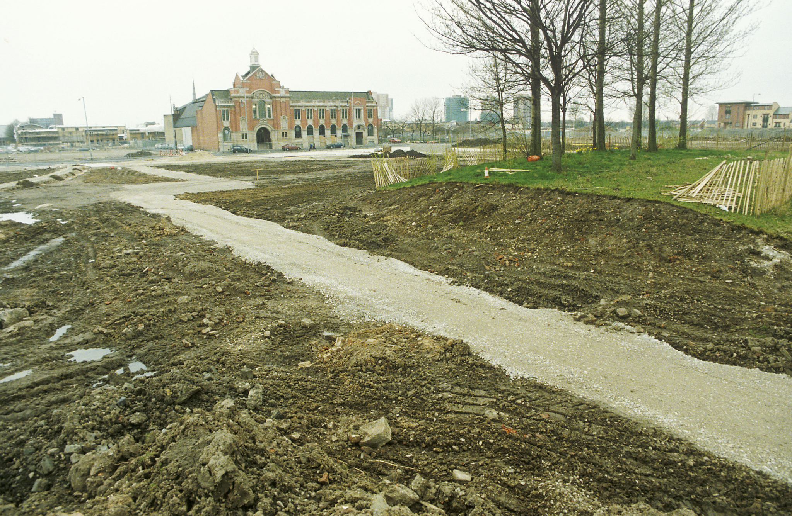
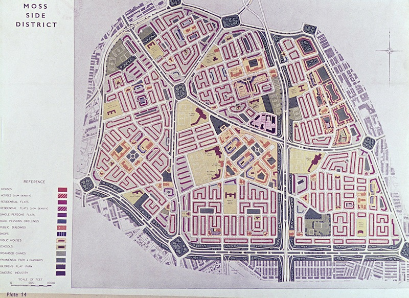
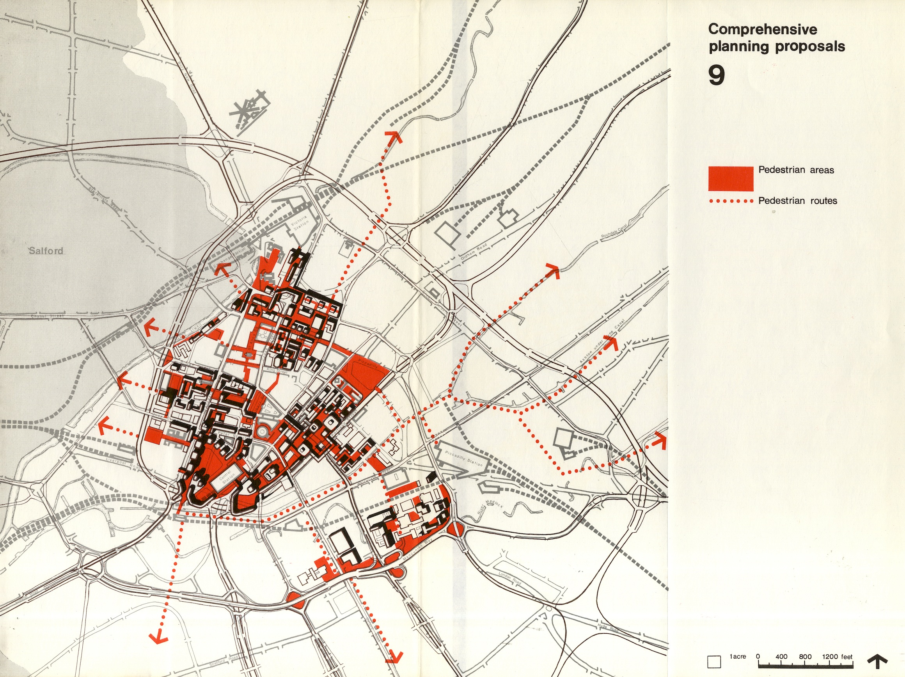
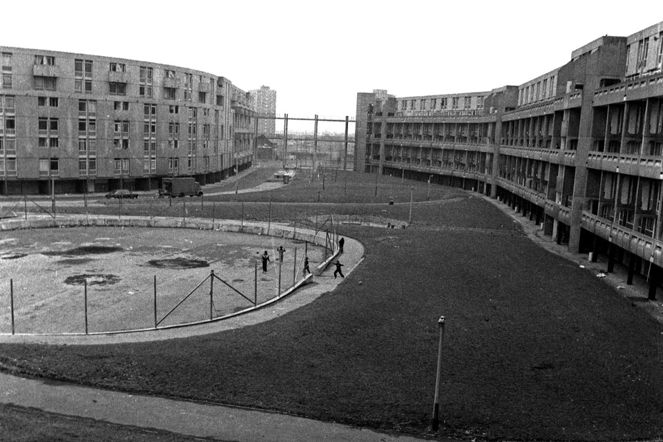
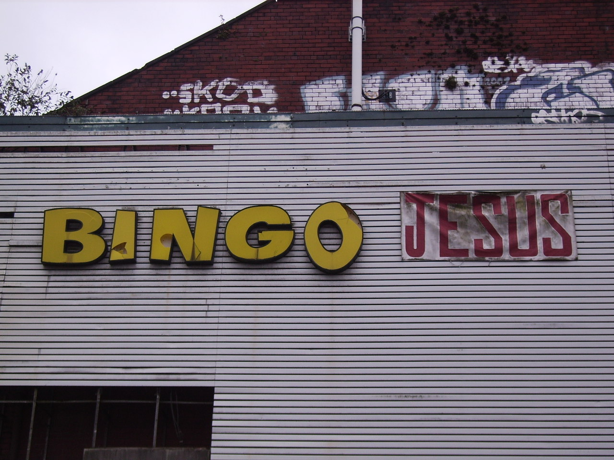

The poplar trees in Hulme Park were planted to beautify the area surrounding the Hulme Crescents. Historical aerial photos reveal these sturdy trees remained constant even as everything around them transformed dramatically. The photograph below shows the same location as it appeared in 1997, shortly after the Crescents' demolition.

I relocated to Manchester in 2006 and arrived in Hulme two years later. As a self-described "map geek" and foreigner, I became fascinated by the area's substantial twentieth-century transformations. I explored local archives, interviewed residents about historical Hulme, and investigated the neighborhood's complex past.

## Pre-WWII Planning

The 1945 City of Manchester Plan outlined post-WWII redevelopment priorities. Hulme, then part of Moss Side, had a population of 102,588 that planners sought to reduce to 37,896. The plan characterized pre-war housing as "a typical and unhealthy example of Victorian working-class housing" featuring "narrow congested streets of small houses" with minimal outdoor space.

## The Crescents Era

The Crescents, completed in 1972, represented modernist brutalist architecture designed to accommodate over 13,000 residents across 3,284 deck-access flats. However, construction quality proved inadequate—concrete slabs misaligned, centralized heating systems proved unreliable, and pedestrian walkways created safety hazards. The estate was declared unsuitable for families within two years.

By 1984, the Council abandoned rent collection for approximately ten years. This period witnessed a distinctive subculture emerge—featuring punk, squatting, music venues like The Kitchen nightclub, and artistic expression comparable to Christiania or East Berlin squats. The estate remained electrically serviced despite the rental freeze.

## Community Identity

The geographical isolation created by surrounding roads (Mancunian Way, Princess Parkway, Stretford Road) fostered strong community identity among residents. This sense of place intensified disagreement over subsequent redevelopment plans and the consultation process's adequacy.

The transformation of Hulme from Victorian slums through modernist utopia to its contemporary mixed neighborhood represents one of Manchester's most dramatic urban narratives. The poplar trees remain, silent witnesses to a century of change.
