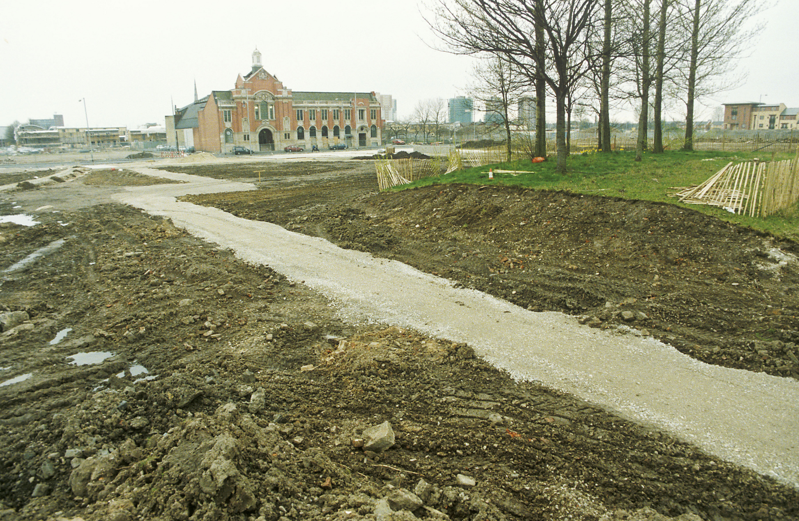
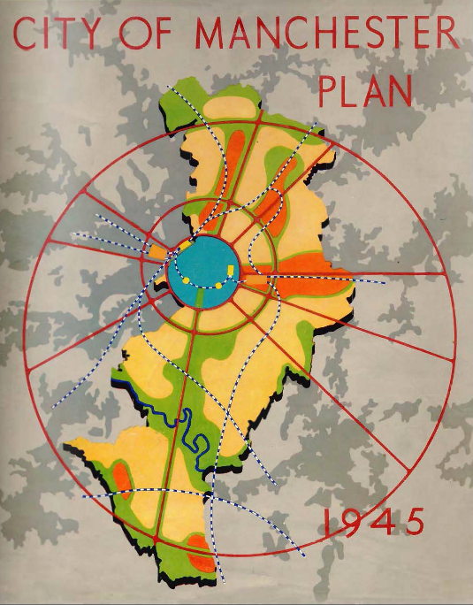
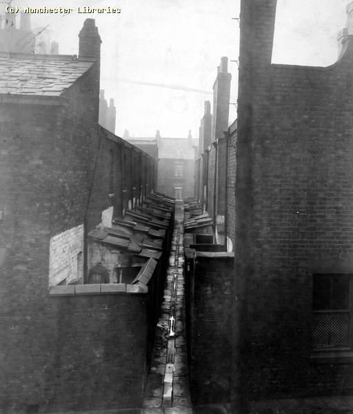
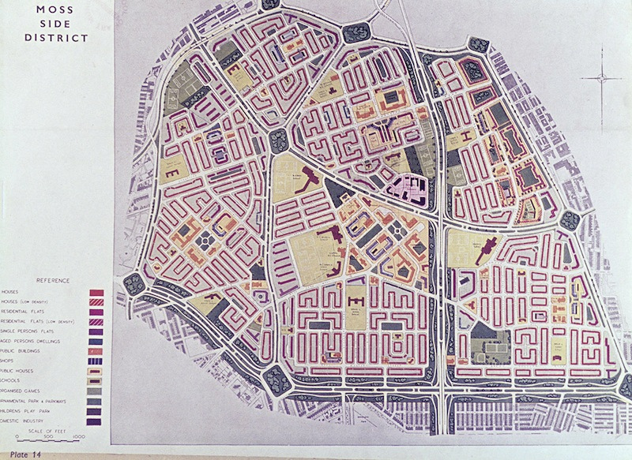
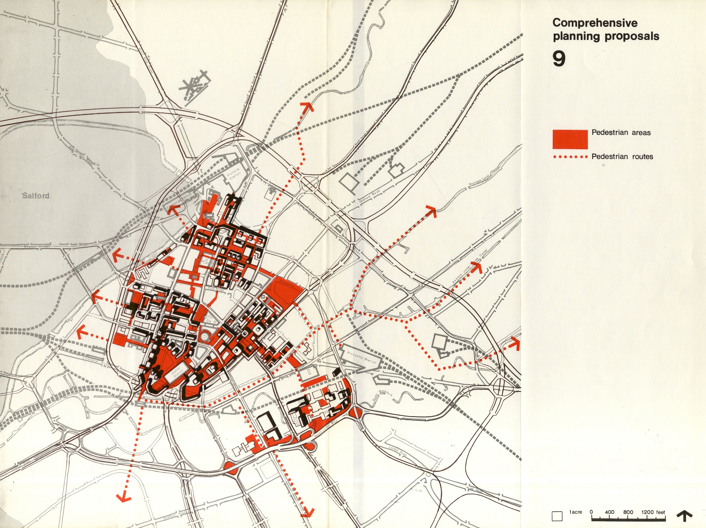
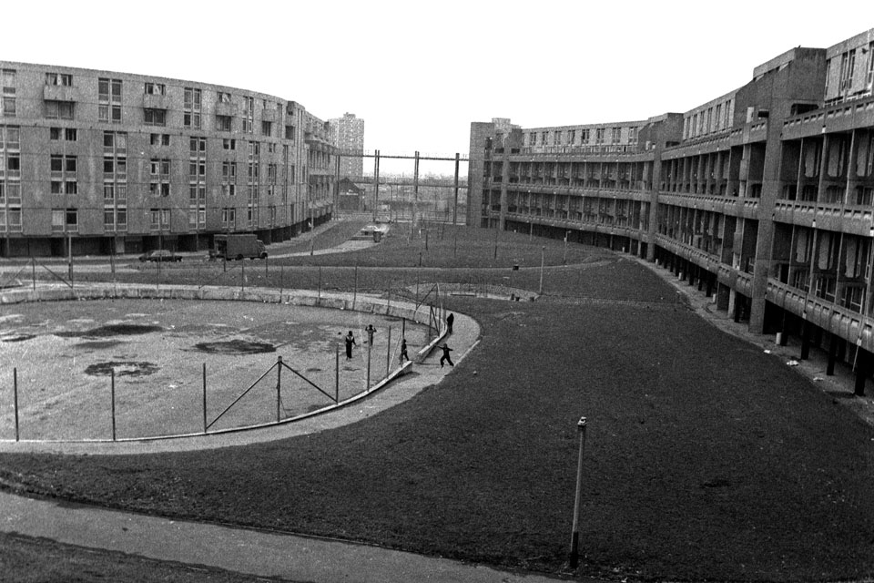
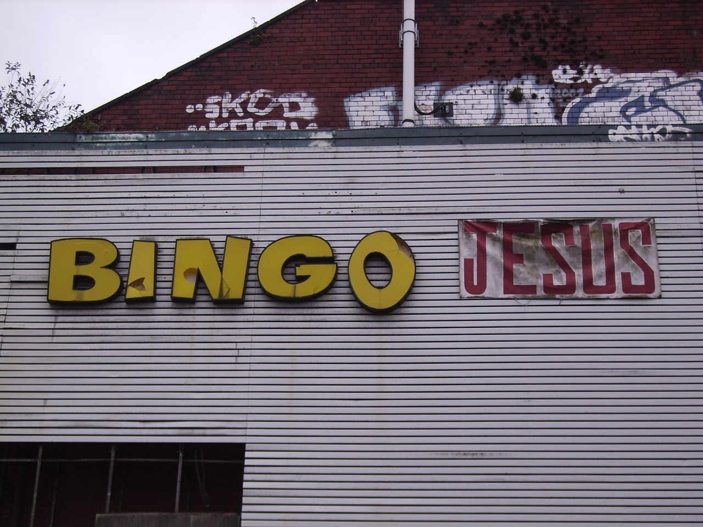

It is strange to think that the poplar trees in Hulme Park were planted as part of an effort to make the area around the Hulme Crescents greener and more hospitable. In some older aerial photographs you can see them clearly: maybe a little smaller than they are now, but still as sturdy. Everything around them has changed so much and yet here they are. The above photo looked like this in 1997, just after the Crescents were ripped down to build where I live now.

I moved to Manchester the second and final time in 2006, and ended up in Hulme two years later. As a foreigner I took to exploring the area where I lived and, as an unreformed map geek, soon discovered that I landed in an area that went through tremendous changes in the last century, some of which are still apparent today. A rather winding road took me to talking to people about their lives in bygone Hulme; I started exploring the archive at Central Library (their map collection is a thing of beauty), and generally nosing around an area and a topic that people already feel very passionate about. Late to the party, but hey.

I recently found the beautiful _City of Manchester Plan 1945_ in which the city planners lay out what they want their city to be like after the end of WWII and the Manchester Blitz. There is a digital copy of the whole thing here. Do go and have a look.

Hulme was one of the areas where redevelopment was planned. At the time, Hulme was part of Moss Side, as were Moss Side East & West, Medlock, St George's, Hullard Park, part of Wilbraham, and some of Whalley Range. The population in 1945 of this area was 102,588 people which the planners wanted to reduce to 37,896, a significant reduction both of people and living spaces. They considered pre-war Hulme/Moss Side as a "slum" area of rotting and congested unfit Victorian housing and wanted to build something modern, green and spacious.

> Hulme and Chorlton-on-Medlock \[...\] are among the oldest localities in the city and were built almost wholly before 1870. Developed to a characteristic mid-nineteenth-century pattern in narrow congested streets of small houses with internally and externally, with only the smallest of backyards in place of gardens, these areas constitute a typical and unhealthy example of Victorian working-class housing. _(City of Manchester Plan, 1945)_

It looked like this:

This is Violet Street which is now somewhere underneath the Mancunian Way, alongside Chester Road. The picture is from 1914 but it would look like this until the late 1960s when this are was finally cleared. The 1945 Plan never did come into fruition and it would have looked very different then.

Looking at this now, it does appear that this was more of a statement of intent rather that a concrete plan: a vision for the future and a wish for things to be better from now on.

In 1967, the city planners made some more realistic plans for the redevelopment of the city centre, including a never-realised Central Station which would serve both the North and the South, combining Victoria and Piccadilly stations.

Of course, then, in 1972, Manchester got its own version of the concrete jungle: the Hulme Crescents. As an example of modernist or even brutalist architecture, they are textbook. They even won design awards (inexplicably to us now?) and rehoused a lot of people in modern, functional council accommodation from the Victorian housing we saw above. They were designed to provide accommodation for over 13,000 people in 3,284 deck-access flats.

In 1979 they looked like this:

The intention was, as far as I understand it, to provide modern social housing to as many people as possible using bold new methods: but in the execution there were significant flaws in both the building construction and design. On a Manchester Modernist Society walk through Hulme recently, I was told by people on the walk that the actual building of some of the Crescents was so shoddy that the concrete slabs did not line up and that you could stick your hand through the gaps of some exterior walls. The heating was centrally controlled (it was 'modern' underfloor heating) so that it was either freezing or too hot. Disabled access was not something that was on the radar then, and lifts were apparently very poorly maintained. As a result, anyone with a buggy eventually wound up lugging this up the stairs of what amounted to tower block. The idea that pedestrians were elevated above the roads (see picture of the walkways) also backfired because these walkways were unsafe for children (one child died after falling off a balcony) and created bottlenecks.

Two years after opening, the Crescents were declared unfit for families and ten years after that, in 1984, they were abandoned by the Council with no further rent collected for the next nine or ten years. Yes that's right, the council didn't collect rent for _ten years_. Unsurprisingly while crime rose, so did a vibrant subculture which artist Michael Mayhew compared to Christiania in Copenhagen or East Berlin squats in the 1980s in a recent lecture.

Whether you think the Cresecents were some kind of anarchist utopia, or a plague-ridden deathtrap is what I find most fascinating about the Crescents. There are so many different opinions about them, both by people who lived there and people who did not. This vibrant subculture of punk, squatting, drugs and music attracted young people from all over the North West and offered refuge to some who simply could not turn to anywhere else. Dogs of Heaven happened. There was a nightclub called "The Kitchen" which comprised of three flats whose walls had been knocked through and which, at times, was more popular than then Haçienda. There was an Art House Cinema. There was a transport workers' club. The Council continued to provide electricity even after they stopped collecting rent.

As someone who grew up in a tower block in East Germany, I find learning about how people lived in the Crescents really interesting. I know what it's like to be in such close proximity with people who you may not even like very much, let alone have to get along with because you share a poorly insulated or soundproofed wall. But people made do and you can read some of their stories here on exhulme's guestbook. The descriptions of the Crescents just before they were demolished remind me of the deserted suburbs in "Do Androids Dream of Electric Sheep" where the "kibble" is slowly but surely taking over everything and making the buildings wholly uninhabitable. "Kibble" is Philip K Dick's neologism to describe the mess and baggage (physical and emotional, but that's for another time) that accumulates in buildings, especially when no one lives there any more. It multiplies until there is no space left untouched by it. The kibble and nuclear winter, but hey, it's about associations, right?

From what I can gather from talking to people, there was an extremely strong sense of place and identity in the Crescents which may have had to do with the fact that the estate was effectively cut off from the rest of the city by the Mancunian Way, Princess Parkway, and Stretford Road being partially pedestrianised. There were no vehicular thoroughfares through Hulme and the Crescents themselves seemed islands onto themselves. So it is not surprising that the people who chose to live there, especially after 1984, did so with a sense of ownership and belonging. Naturally, once the Council decreed that the Crescents had to come down and they had received even international notoriety, these people wanted their voices heard about redevelopment.

Most people who lived in the Crescents agree that they needed to come down; the trouble started when it came to what would happen to the area next. There is still a lot of debate about the consultation process, the Council's role in the redevelopment of the area, how the residents' views were (not?) taken into consideration and what could have been. I would go so far as to say that there is still a lot of bad blood around. There is a lot of information around about this period, for example urbed's planning documents, this blog post, and Manchester City Council's own report and many more.

I would say though that everyone with an interest in the past, or urban development, is richly served with Hulme history. Be it densely populated and busy Victorian roads when Hulme needed its own town hall and had one of the busiest shopping streets in the city (with trolley cars!) in the shape of Stretford Road; or be it during the estate-like isolation of the Crescents which brought about their own creativity; or be it today where Hulme is relatively transitory and full of families, students, and yuppies. Hulme has been home to many of us. I, for one, still really like it here. I miss the Bingo Jesus sign, though...

_Initial photograph and edit by Kim Foale. Article contains lots of images nicked from the internet: we've tried to put attribution on everything but let us know if we missed something!_
