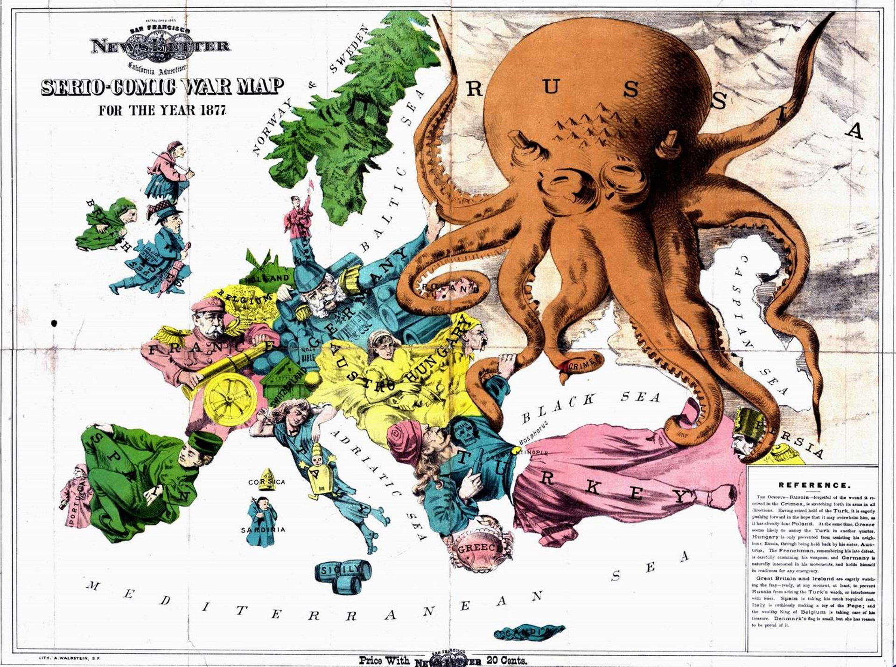

There has been an explosion in the use of maps to visualise data, prompted by the rise of the "data scientist", available open data, and a wealth of new tech tools. Authors like Tufte a Few have created ground rules and beautiful examples of what's possible with data visualisation, from the minimalist to the maximalist. With access to big data sets and a basic grounding in statistics, it's possible to make all kinds of quantitative data visualisations using tools from R (a DSL for data manipulation) to Tableux (freemium data visualisation software).

What though of qualitative data visualisation? How can we visualise cultural changes, geographical changes, or the movement of communities? There is no shortage of inspiration for mapping say, population density, crime or employment rate, or anything that makes a neat quantifiable percentage; even if the underlying statistic is in itself flawed, it still makes a pretty map. Visualising good qualitative research in interesting, interactive ways still feels under-explored.

## Why does my map look poorly?

Overwhelmingly, qualitative data is represented using what I call a "pincushion" map. Arbitrary pointers referring to qualitative phenomena are plotted on a map, with no order or story told. At its most extreme this kind of data looks like the aftermath of a paintball game: an unnavigable mess of markers vying for attention that don't tell you what they do till you click on them, a classic example of the "mystery meat" anti-pattern which supposedly went out of fashion a decade ago.

Here's some examples. The first from the British Library's Sound Archive, which makes it look like the UK has measles.

Clicking one of the zits gives us some context...

What does this have to do with the map? Seemingly nothing. I can't even see where this came from as it's overlaid the map. I'll give them a break for the poor metadata as this is seemingly user contributed data: but a map here seems a particularly poor choice for showing these sounds. Have data, must project?

This is a particular poor example of mapped data. However, I think the pattern is flawed even when done well. Here's one from Trafford Intelligence Lab.

At least here we have some clue what we're going to see before we click on it. The cog on the left navigation allows us to toggle and untoggle layers. Again though: I struggle to imagine any uses for this map. If I want to know what arts spaces there are, I'm going to do a search for that in Google Maps. If I want to find out where there's a lack of say, services for over 50s, the map's far too busy to make a meaningful reading, and even then it doesn't tell me if there are actually people over 50 living there. It would help a little if the markers would "dodge" each other and not overlap: however it would then lose it's accuracy.

As a design pattern I think it falls flat: I'd much rather read this information in a simple directory with a filter for region. It simultaneously has too much and too little data: not enough to make a reading of anything, but so much that the output is cluttered. Perhaps this would be better as a series of visualisations using the same technology: as is though the smorgasbord approach is overwhelming.

With both of these maps I'm really struggling to imagine what I'd actually use them _for_. In neither case do I think this is the best representation of the data.

## Examples of mapping qualitative data that work

It's been a struggle to find good examples. The few I like tend to do one or two things beautifully, with a strong focus.

This version of Buckminster Fuller's Dymaxion map by Geoff Christou, which shows an interpretation of the historical migration of his own family, is somewhat qualitative. The Dymaxion map is my favourite projection: showing the globe as an unfolded icosahedron centred around the North pole shows the world as a connected landmass in a way nothing else manages.

The lines show the migration of his family, as far back as he can chase it. It's a simple visualisation that's extremely effective at demonstrating how we are all people of the world: I could see myself using something like this as a tool to argue for free migration, for example.

Another example I really like is Mike Bostock's visualisation for this travelogue piece. This is an extremely minimalist example, but lets the copy tell the story, augmented by a sparkline-style map which shows where you are both in the piece, and where the story is geographically: a really clever combination of two bits of information. Click through and have a scroll.

Finally, I have a real soft spot for the "map as propaganda".

While this is essentially a cartoon plotted onto a map, it shows a lot about national stereotypes at the time (and perhaps today). The graphics are directly laid on top: showing national tensions and perceived tendencies using illustration in a way that wouldn't be nearly as engaging as say, a series of lines showing where conflicts arise.

## Are maps themselves qualitative data?

Of course, almost all data is both qualitative and quantitative: as Ann Oakley outlines, attempting to split the two or make claims for the superiority of one or the other is futile and stifles progress. Even the most quantitative data requires interpretation to make sense and not just be a jumble of numbers; even the most qualitative data requires justification as to its importance in some way. Well conducted research uses the data most appropriate: whether a table of values or an open-ended interview. We need the right tools for the right job.

Maps themselves are perhaps one of the most used qualitative data visualisations in everyday use. Yes, they're made up of millions of data points measured quantitatively: but they give no intrinsic reading about these points mean without a key or local knowledge, a perfect vindication of Oakley's paper. Data is meaningless without context and vice-versa. To any reader, they're clearly an abstraction, a way of finding our way around. There is no intended start or end point. They allow a lot of approximation, but accurate measurement requires an extra tool. We know they go out of date, and make mental notes of the parts of them that are obsolete. A map helps you find your way around: pinpoint accuracy is not a priority.

Quantitative data though -- statistics on anything from immigration to tax to population growth -- perhaps an air of objectivity that maps do not. They're reported verbatim by politicians and press, and rarely questioned or seen as an interpretation in the way that a map is. We rarely question where numbers have come from one they've been plotted.

It's somewhat fitting then that the easiest and most immediately obvious visualisations to make when given a new tool are to map quantitative data on top of it. Quantitative data tends to be dry, flavourless: we know, for example, that 20% unemployment is bad and 5% is better: but represented on a table this looks like so much accounting data. Projected onto a map, things change: we can see the boundaries of unemployment, we can look at where we live and place ourselves in this world. The map gives us the qualitative flavour to interpret our Excel spreadsheet.

The downside is that the accuracy can be low: any deprivation index for example can have quite a low geographical resolution, so while an area might have several different pockets of varying deprivation, these will be averaged out in a way that can lose crucial context. However, the perfectly mapped boundaries of a digital map can make it look more accurate and authoritative than it is: similar to how representing a 0 as 0.00000 implies accuracy which might not be there, a map area with perfect boundaries implies a misleading level of geographical accuracy.

Another problem is with showing changes over time. While there is a large move towards open data through sites like data.gov, these only tend to apply to relatively recent data. The way things are measured and what's important changes a lot, so while comparing the last 5-10 years is manageable, comparing the last 100 is significantly harder and it will take a long time for our datasets to catch up. This means any time-series visualisation will have a fairly recent cutoff point, and the medium will overwhelmingly start affecting the message.

## So how can we use maps effectively as designers and researchers?

I think like most modern technologies, now we have them we need to take a step back. It's easy to project X onto Y: now we need to apply a level of research, design and UX that is normal for any other more mature technology.

Some ideas.

### Be opinionated

The main problem with pincushions is that they give no route through the data. Clearly the visualisation has been made for a reason: so make the reason clear. Why have you built the map and what can I take from it? Being opinionated can feel like losing objectivity: but everything is subjective and political, even the Gall-Peters projection is a political statement. Be upfront about the meaning of the visualisation and what you hope to gain from it from the outset. It's more honest and will create maps which answer one or two specific questions, rather than answering no questions at all.

### Give the user a path

If the visualisation doesn't have an obvious route through it, give it one. Create a timeline, a tour, or reduce the data points to where everything is visible. As Bret Victor argues, a website should give just as much information as a printed map _before_ interacting with it. Clicking should add more context that wouldn't fit on paper, not be a crux for poor design at the outset.

### Concentrate more on content

As a coder I know this one well: often the tech challenge is so large that once it's in place, it feels finished. This is not the case. The technology should be invisible: we should be just as keen to tell a story with our visualisation as we would with a press release or pamphlet. What is the story you're trying to tell?

## Next time...

I'm working on a project that's tried to learn from all these and create an engaging history map fro Hulme, where I live. It's still in development, but in the next article I'm going to aim to explain what we did and if it worked or not. Let me know if you see any good examples of maps that transcend my critiques!
