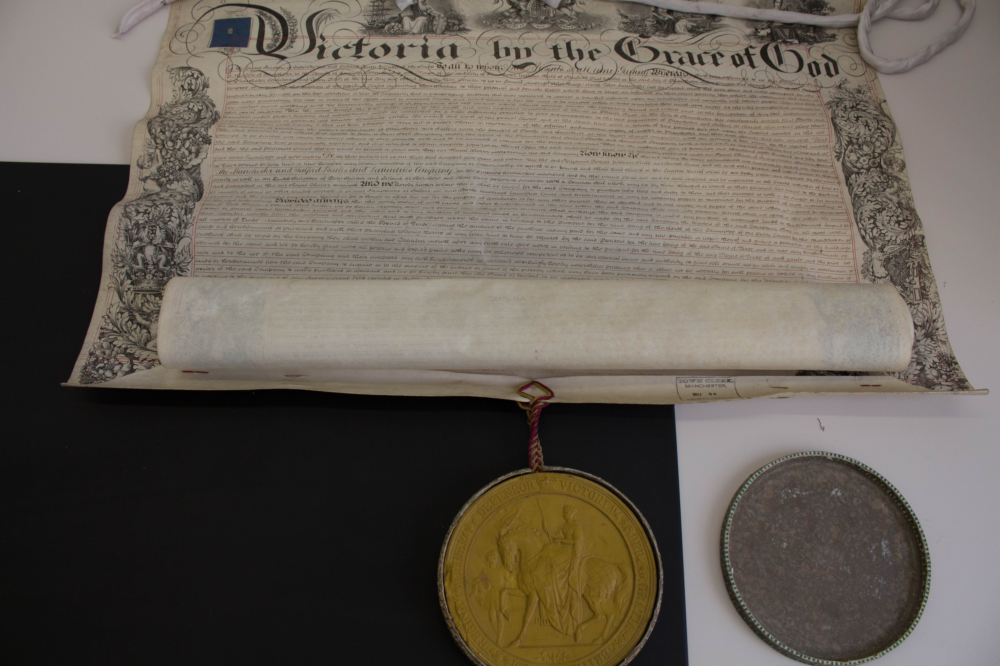
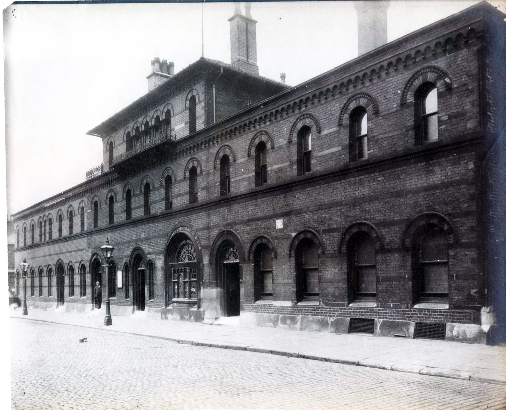
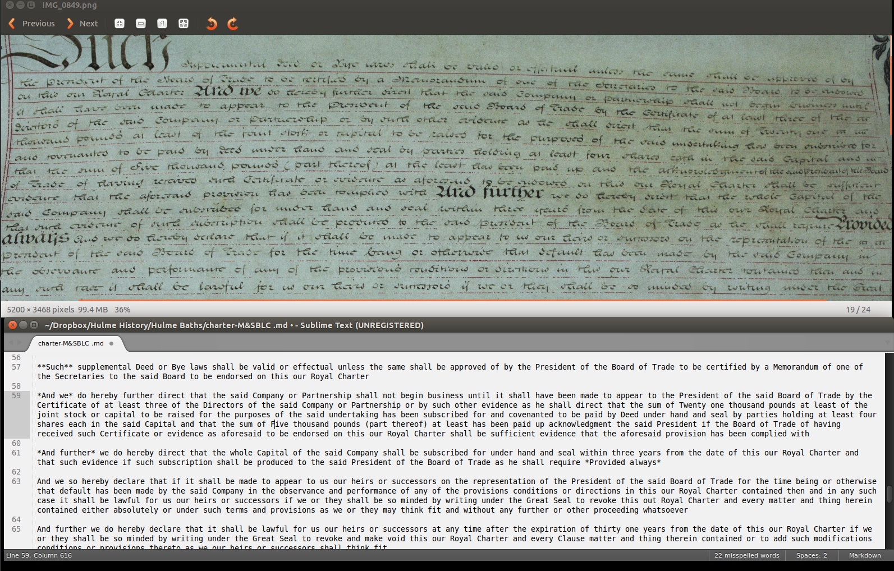
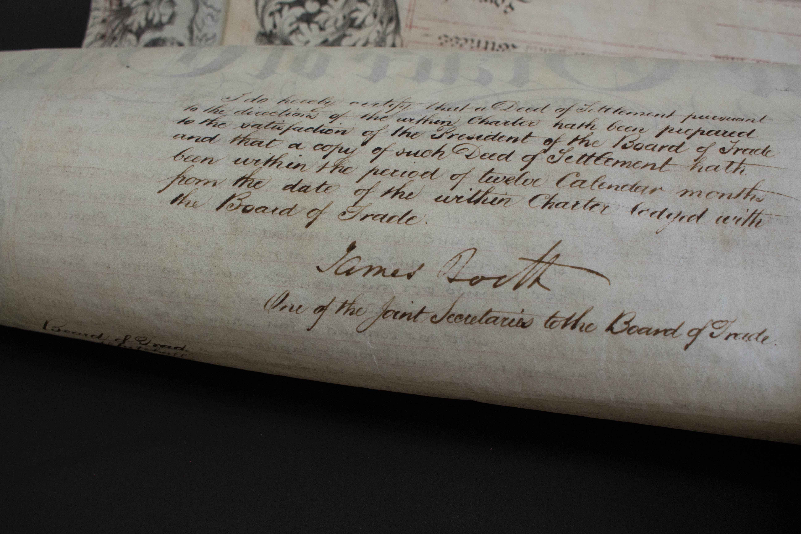

A week's gone by and I'm wondering why I've spent it transcribing an enormous legal document from 1855. What does a huge certificate from 1855 have to do with the history of Hulme?

This is Manchester and Salford Baths and Laundries Company's Royal Charter.

It's a beautiful piece of calligraphy: handwritten and illustrated, with a Royal Seal attached. It needs a special box for storage and this one is one of about 980 Royal Charters which have ever been issued; there are only about 750 of these still in existence. This one became void in about 1875 when the Company was incorporated by the Manchester Corporation.

## The Starting Point: Leaf Street Baths

Back to where this all started: my interest in Leaf Street Baths in Hulme. This lovely building was the third public bath and wash house built by Thomas Worthington for the Manchester and Salford Baths and Laundries Company in 1860. It had a male and a female section: both with a number of slipper baths, a laundry, and a pool, much like Victoria Baths. It was demolished in the 1976 slum clearances.

I wanted to find out more about Manchester and Salford Baths and Laundries Company, so I checked if there was anything in the archive and yes, there was—a Royal Charter. I went and had a look. By that point, I'd read on the internet about the 1846 Baths and Wash Houses Act that allowed local councils to use public money to build bath and wash houses. I knew that the Company operated for about 20 years, and that they built nine baths and wash houses in Manchester and Salford. It was run by philanthropists because Manchester Corporation did not do very much to improve the public sanitation situation at that point in time.

## The Challenge of Transcription

So what did I find? I found a beautiful and at that time almost completely incomprehensible document. The Charter is so big that you can't lean over it very easily, and trying to read it standing up or perching awkwardly on a chair was only fun for so long. I gleaned some things from the first few paragraphs which interested me enough to decide to transcribe the thing for easier access.

I also learnt that The Manchester and Salford Baths and Laundries Company was set up by Benjamin Nicholls, Mayor of Manchester at the time as well as a cotton spinner and mill owner, William Neild, a calico printer and owner of Mayfield Print Works, and Joseph Heron, the Town Clerk, as well as a large number of other people who had shares in the Company.

The exact date of the Charter was 21st June 1855.

Between them, they managed to sell 7,000 shares at £5 each to set up this Company which is an impressive feat given that £5 would amount to between £517.30 and £12,500 depending on how you calculate it. Even if we take the £517.30 amount, it was still very impressive to find 7,000 people to buy shares.

## Technical Difficulties

I did not really realise what kind of document I was looking at when I first saw it. I knew that I would not be able to spend all day with it in the search room, so I took quite a lot of pictures. While I was in the search room I tried to transcribe a passage, still thinking I would capture some flavour and quickly found how difficult this was going to be.

I spent a lot of time of the first few days trying to guess words or trying to match up the letters with other times that letter occurred on the page. After about two days I realised that the lower case letter "c" is written in here very similarly to the lower care letter "r" and that made so much more sense when "arrorsing" (as an obvious example) became "according". Another obvious trap is the similarity of the lower case letters "s" and "d" which gave me all sorts of trouble until I figured it out and "rade" finally became "case".

The other thing I only realised way too late into the process: **this is a legal document**. I cannot stress this enough because I had no idea when I started reading just how much legalese there was in this. "Hereditament" (a property which can be inherited), "body politic", and "mossnages" (a type of terraced house, I think) are all words and phrases I had never really heard before and while some of these are beautiful words, some of these gave me such a headache that I ended up learning way more about land law and covenants than I ever expected. Also, there is no punctuation in the whole thing. It is very tightly spaced.

I kept losing my place and because the sentences are so strange, I would not notice until a few days later when I looked over it again. I missed a whole paragraph one time and somehow the sentence still kind of made sense.

## Historical Significance

I have learnt about the social situation in Manchester which allowed the Company to come into existence, who set it up and under which parameters it was operating. This Company is a great example of the "five per cent philanthropy:" philanthropic intention with a capitalist return, something that was apparently very common during this time and frequently used for the erection of public buildings, like hospitals, orphanages, workhouses, or schools. There are quite a few still around in Manchester today.

## Company Dissolution and Legacy

The Company was incorporated into the Manchester Corporation in 1875 or thereabouts. We don't know a lot about this acquisition; one might reasonably hypothesize that the Company was probably having trouble breaking even given that their clientèle were predominantly on low or no incomes with very little money to spare. The continuing building of infrastructure, connecting more and more houses to the water grid as well as the fluctuations in the coal prices probably also had an effect, as did changes in legislation around the provision of public health (like the 1875 Public Health Act). To this day, swimming pools are hugely expensive to run.

I wonder what happened to this idea of the public (well, the wealthy public) owning public services: for something that seemed so common at the time, there is now barely a trace of it when it comes to ownership of our public services.

## Conclusion

Quite a lot to learn from a single document!
