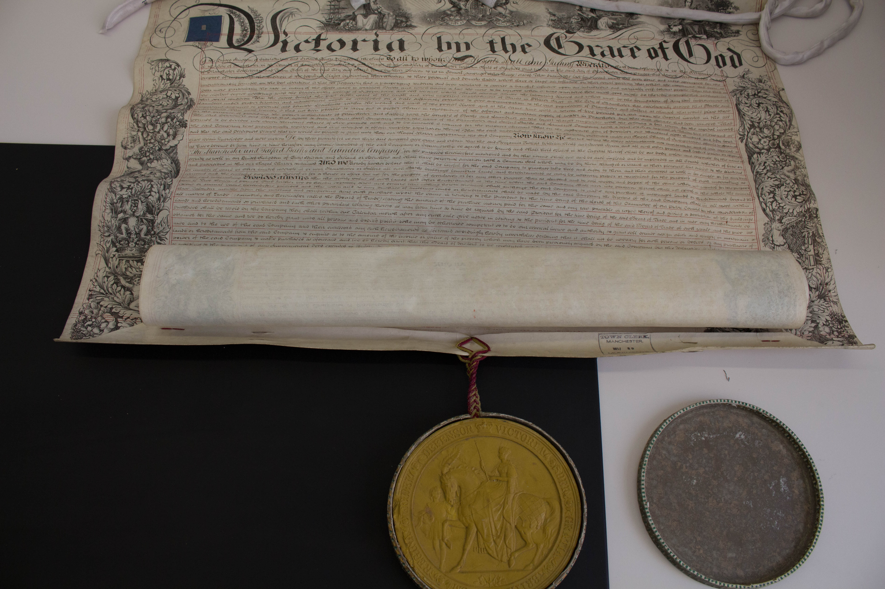
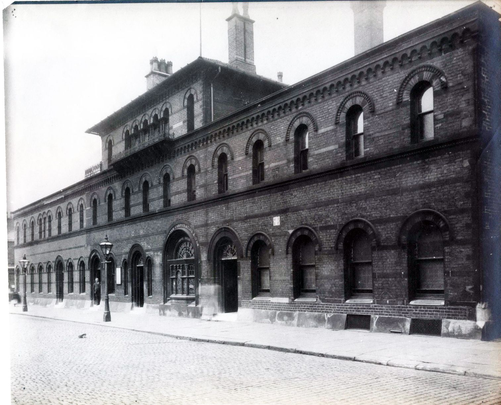
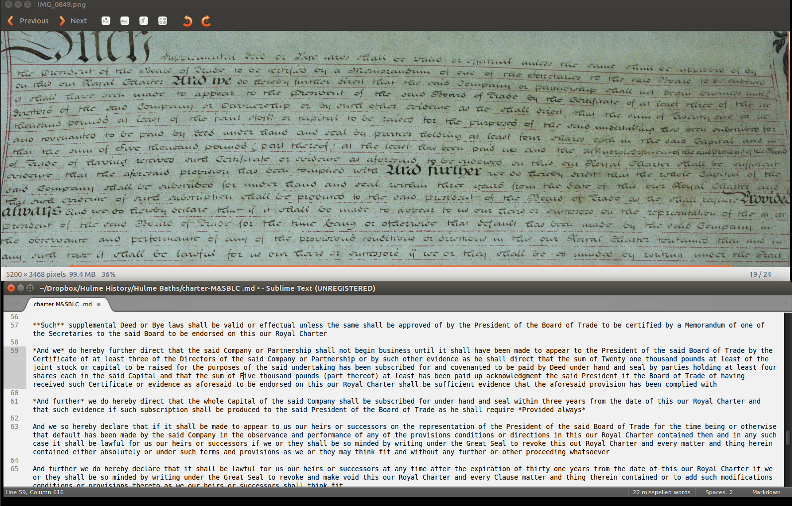
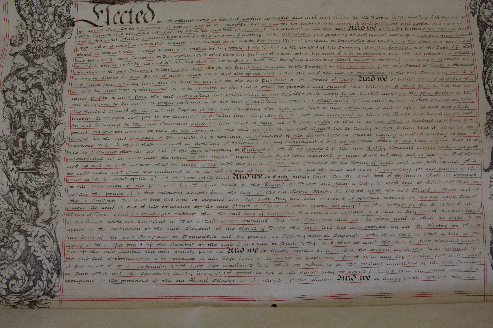
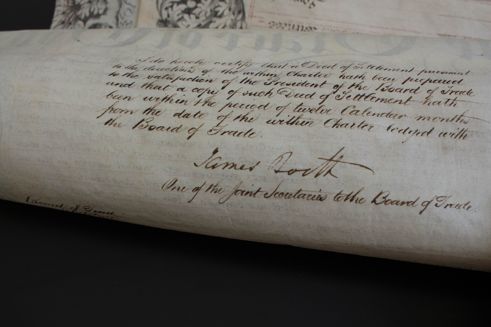

A week's gone by and I'm wondering why I've spent it transcribing an enormous legal document from 1855. What does a huge certificate from 1855 have to do with the history of Hulme?

This is Manchester and Salford Baths and Laundries Company's Royal Charter:

It's a beautiful piece of calligraphy: handwritten and illustrated, with a Royal Seal attached. It needs a special box for storage and this one is one of about 980 Royal Charters which have ever been issued; there are only about 750 of these still in existence, according to Wikipedia. This one became void in about 1875 when the Company was incorporated by the Manchester Corporation -- but I am getting ahead of myself.

Back to where this all started: my interest in Leaf Street Baths in Hulme.

This lovely building was the third public bath and wash house house built by Thomas Worthington for the Manchester and Salford Baths and Laundries Company in 1860. It had a male and a female section: both with a number of slipper baths, a laundry, and a pool, much like Victoria Baths. It was demolished in in the 1976 slum clearances.

I will write more about this little gem in a future blog post, so stay tuned!

I wanted to find out more about Manchester and Salford Baths and Laundries Company, so I checked if there was anything in the archive and yes, there was -- a Royal Charter, whatever that was. I went and had a look. By that point, I'd read on the internet about the 1846 Baths and Wash Houses Act that allowed local councils to use public money to build bath and wash houses. I knew that the Company operated for about 20 years, and that they built nine baths and wash houses in Manchester and Salford. Oh, and that it was run by philanthropists because Manchester Corporation (now Manchester City Council) did not do very much to improve the public sanitation situation at that point in time.

So what did I find? I found a beautiful and at that time almost completely incomprehensible document. The Charter is so big that you can't lean over it very easily, and trying to read it standing up or perching awkwardly on a chair was only fun for so long. I gleaned some things from the first few paragraphs which interested me enough to decide to transcribe the thing for easier access.

I also learnt that The Manchester and Salford Baths and Laundries Company was set up by Benjamin Nicholls, Mayor of Manchester at the time as well as a cotton spinner and mill owner, William Neild, a calico printer and owner of Mayfield Print Works, and Joseph Heron, the Town Clerk, as well as a large number of other people who had shares in the Company.

The exact date of the Charter can be seen here: 21st June 1855.

Between them, they managed to sell 7,000 shares at £5 each to set up this Company which is an impressive feat given that £5 would amount to between £517.30 and £12,500 depending on how you calculate it. The latter result may sound excessive, but we are measuring historic investment into a project which according to Measuring Worth can either be measured in Historic Opportunity Cost or Economic Cost. Check out their glossary of terms for exact explanations of everything related to understanding historic values of money. Even if we take the £517.30 amount, it was still very impressive to find 7,000 people to buy shares.

I did not really realise what kind of document I was looking at when I first saw it. I knew that I would not be able to spend all day with it in the search room, so I took quite a lot of pictures. While I was in the search room I tried to transcribe a passage, still thinking I would capture some flavour and quickly found how difficult this was going to be. I left out about five lines at the top because I could not make them out bent over the scroll and then had to go back every other word to check what it was. At home, my screen looked like this a lot:

I spent a lot of time of the first few days trying to guess words or trying to match up the letters with other times that letter occurred on the page. After about two days I realised that the lower case letter "c" is written in here _very_ similarly to the lower care letter "r" and that made so much more sense when "arrorsing" (as an obvious example) became "according". Another obvious trap is the similarity of the lower case letters "s" and "d" which gave me all sorts of trouble until I figured it out and "rade" finally became "case".

The other thing I only realised way too late into the process: **this is a legal document**. I cannot stress this enough because I had _no idea_ when I started reading just how much legalese there was in this. "Hereditament" (a property which can be inherited), "body politic", and "mossnages" (a type of terraced house, I think) are all words and phrases I had never really heard before and while some of these are beautiful words, some of these gave me such a headache that I ended up learning way more about land law and covenants than I ever expected. Also, _there is no punctuation in the whole thing_. It is very tightly spaced as you can see here:

I kept losing my place and because the sentences are so strange, I would not notice until a few days later when I looked over it again. I missed a whole paragraph one time and somehow the sentence still kind of made sense.

I have learnt about the social situation in Manchester which allowed the Company to come into existence, who set it up and under which parameters it was operating. This Company is a great example of the "five per cent philanthropy:" philanthropic intention with a capitalist return, something that was apparently very common during this time and frequently used for the erection of public buildings, like hospitals, orphanages, workhouses, or schools. There are quite a few still around in Manchester today.

Here are some choice quotes. I have added punctuation and some words to make it easier to read.

> That during the last few years work has been done and more attempts for the purpose of improving the condition of the working classes by orienteering their attention to those personal and domestic habits which have so large an influence on their societal position \[has been done and\] that whilst the movement had been unquestionably founded on the best intentions, it has too frequently had a pamperizing tendency and been calculated to exercise a baneful influence upon an industrious and naturally self reliant people.

> _And we_ do hereby further direct that the said Deed of Settlement shall be prepared to the satisfaction of the President for the time being of the Board of Trade, and that a Copy of such Deed of Settlement shall within the period of twelve calendar months from the date of this our Royal Charter be lodged with the said Board of Trade, and that a Certificate that such Deed had been so prepared as that such Copy had been so lodged as aforesaid endorsed on this our Royal Charter under the hand of one of the Secretaries of the said Board of Trade or other person authorized in that behalf by the President of the Board of Trade shall be conclusive evidence that the said Deed of Settlement has been duly prepared and that a copy thereof has been lodged in accordance with our directions in that behalf above contained.

There is even a handwritten note overleaf to declare that this Deed of Settlement indeed had been lodged with he Board of Trade.

The whole text can be found here.

The Company was incorporated into the Manchester Corporation in 1875 or thereabouts. We don't know a lot about this acquisition; I am going to hazard a guess and say that the Company was probably having trouble breaking even given that their clientèle were predominantly on low or no incomes with very little money to spare. The continuing building of infrastructure, connecting more and more houses to the water grid as well as the fluctuations in the coal prices probably also had an effect, as did changes in legislation around the provision of public health (like the 1875 Public Health Act). To this day, swimming pools are hugely expensive to run and we don't even have a slipper bath before plunging in.

I wonder what happened to this idea of the public (well, the wealthy public) owning public services: for something that seemed so common at the time, there is now barely a trace of it when it comes to ownership of our public services. Perhaps they would now require too much capital, perhaps the state provides these services more efficiently, but it is strange that this kind of public philanthropy seems all but gone.

Quite a lot to learn from a single document!
