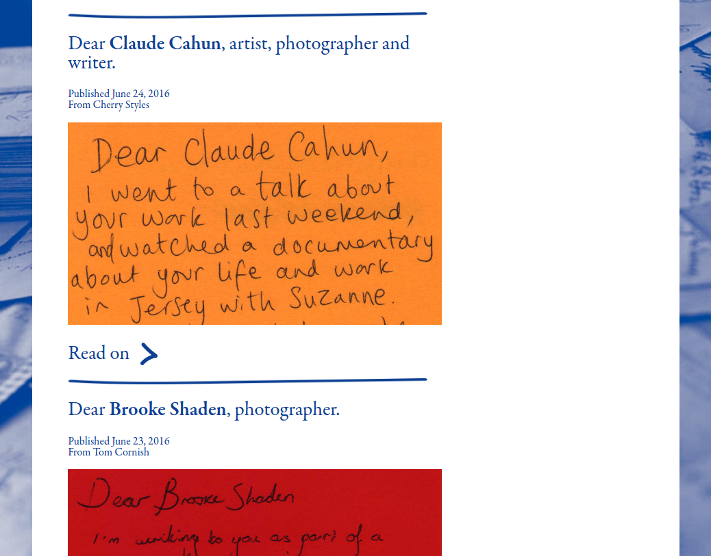

Dear Friend is a letter-writing project celebrating women in public life and struggles for liberation. I co-founded this project with Sylvia Kölling as part of [The Cassowary Project](http://cassowaryproject.org/), our DIY research project into identity, place, and history.

[Visit Dear Friend now!](http://dearfriend.org.uk/)

The goal of the project is to raise the profile of women in history and let anyone who wants to write a letter contribute to a growing archive. We run workshops at events, and accept letters by post - for full info on how to contribute, check out the site.

This site was developed in [Metalsmith](http://www.metalsmith.io/), a node.js-based static site generator. The source is compiled by [Travis](https://travis-ci.org/kimadactyl/dearfriend-v2), and pushed back to GitHub Pages, which adds a nice layer of protection from bad commits. This kind of solution is fast becoming my go-to for no-budget or low-budget sites: static sites are free to host, ultra-fast, extremely stable, and are easy to migrate to a fully fledged CMS later if required. Not building an admin interface saves tons of time that can be better spent on running the project.

I enjoyed working with Metalsmith, but am finding the lack of documentation and relatively immaturity of the project frustrating. Simple things like sorting lists by date seem extremely difficult to do compared to the Ruby-based systems I'm used to. I think I'll go back to Middleman or Jekyll for now, but will definitely be keeping an eye on it in future as it promises to be an extremely flexible toolkit.

Anyway, I hope you enjoy the site and feel free to [send a letter](http://dearfriend.org.uk/contribute/)!

**Team:** Kim Foale (development), Mark Dormand (design), Sylvia Kölling (content manager)
**Tech:** Metalsmith, Github Pages, Susy
**When:** Spring 2016
**Source:** [GitHub](https://github.com/kimadactyl/dearfriend-v2)
