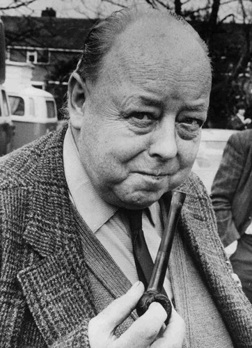

I'd never heard of Paul Graney before Tuesday. In Central Library, as part of Manchester Histories Festival, I learnt about a man curiously absent from any number of histories.

Paul is most famous for his archive of sound recordings of folk concerts and interviews with his friends. Born in 1908 in dire poverty, he captured the sounds and experiences of industrial Manchester. His archive comprises of hundreds of tapes, notebooks, photographs (he was also an accomplished photographer), and other paraphernalia, from a life of collecting and hoarding. He spent some years living as a destitute tramp, possibly fought in the Spanish Civil War, got in brawls with fascists whenever given the opportunity, and worked as everything from an ironworker to a theatre set designer. The whole time, he carried cameras, notebooks, and tape recorders, capturing anything and everything that interested him.

You can read about him in the book which has recently been published, edited by one of his friends, and browse some of his recordings on the Archives+ SoundCloud. This story about "Coal Pie" is particularly wonderful.

Paul is now tentatively being credited as being a crucial pioneer in the field of oral history, although his disdain for academia would probably mean the man himself would hate this.

To add another title he'd hate, I want to add that he predates the field of Acoustic Ecology by around 15 years (exact dates a little fuzzy). Acoustic Ecology is one of the fields from which Soundscape Studies emerged (the subject of my PhD research if you've not read any of my other work), mostly in 1970s Canada. The key text is R Murray Schafer's ubiquitous _The Soundscape: the Tuning of the World_, which is part theory part toolkit for understanding our acoustic surroundings. Something about the acoustic ecology idea always rubbed me the wrong way: a feeling of a lack, or half a story being told.

In my thesis I was pretty rude about this. One prominent author implied that having "\[the\] aural sensibilities and ethical conscience of the musician" made that person somehow a more important listener. I found the group had a certain image of themselves as 'sonic explorers' in this ecological approach, kind of latter-day Elgins. Schafer et al perhaps saw themselves as acoustic pioneers, ignoring the technology they used to get to the spaces (cars, planes and recording equipment), creating sonic spectacle for the cognoscenti. As one author pointed out "paradoxically, the deep wilderness is accessible only either to those who believe themselves to be eschewing technology, or to those who actively embrace it" -- raising the status of the quiet, the high-fidelity, 'unspoiled wilderness' above all others. The WSP defined "criteria such as variety, complexity and balance to describe a positively functioning acoustic community". There seems to be an implicit denial that these can happen in the lo-fi city. Sophie Arkette put this as "a romantic bias towards antiquarian or rural soundscapes, as if these are assumed to be more refined than their modern-day equivalents".

_The World Soundscape Project, looking like a 70s prog band._

Schafer hated the lo-fi city soundscape of the city at the time he wrote _The Tuning of the World_. I found it hard to read this as anything other than intellectual snobbery, kind of like the people banging on about their latest triathlon or Buddhist retreat in a yurt or George Monbiot's cringe-inducing article about how kayaking saved him. Please note I have a huge admiration for Schafer and the WFAE's work, this represents pretty much my only major critique of the field, and they may have changed their minds in the meantime!

Arkette continues her defence of the city as an interesting sonic environment.

> Schafer's project is full of acute observation, much of which I agree with, I have fundamental misgivings about his approach. To say that the urban supervenes upon the natural soundscape, and that urban sounds can be cleaned up to resemble natural sounds is to misread the dynamics of city spaces. A city wouldn't exist if it mirrored agrarian sonic space. \[...\]
>
> To say that cityscapes can be reduced to a matrix of soundwalls is to misread the notion of city. City space has been and is constantly being carved up into communities defined by economic, cultural, ethnic, religious divisions and consequently acoustic profiles and soundmarkers are in constant transition. Equally, amplitude and density level change, sometimes radically, according to the time of day or the day of the week. Walk around the commercial London districts of Bank or Clerkenwell on a weekend and you'll find that these hollow spaces resonate footsteps in a number of distinct ways; from the sharp attack as sound is reflected off glass to the softer sonic envelopes as sound collides with, and is partially absorbed by, stone. On the other hand, walking through Brick Lane market on a Sunday morning you can hear myriad vocalized advertisements, each voice having its own distinct inflection, modulation and rhythmic pattern.

I agree. I think city soundscapes are just as fascinating as anywhere else, and aethetic fidelity is more complex than simply "signal to noise" ratio. I always felt there must be another shoe waiting to drop somewhere. There had to be someone or some group documenting their surroundings like the WFAE did, but with none of the spectacle or hoopla -- just mundane recordings of the day-to-day industrial city. Now I know that there was at least one person, and what a recordist he is. Graney seems to be a master recording engineer and interviewer: on tape, he is an engaging storyteller with a knack for drawing out stories from people. He seems to have been consistently in the right place at the right time and asking the right questions, vital skills for any journalist, not least a sonic one. Despite what was presumably pretty terrible equipment and storage conditions, presumably bashed around a few pubs and protests, the archive holds up remarkably well from a production standpoint.

John Ruskin was also a fan of the city. He wrote, in 1853, this piece, comparing the variety and beauty of nature to that of industry. His style is tricky to read but it's worth it:

> Let us contrast \[the animals of the African Steppe's\] delicacy and brilliancy of colour, and swiftness of motion, with the frost-cramped strength, and shaggy covering, and dusky plumage of the northern tribes; contrast the Arabian horse with the Shetland, the tiger and leopard with the wolf and bear, the antelope with the elk, the bird of paradise with the osprey; and then, submissively acknowledging the great laws by which the earth and all that it bears are ruled through their being, let us not condemn, but rejoice in the expression by man of his own rest in the statues of the lands that gave him birth.
>
> Let us watch him with reverence as he sets side by side the jasper pillars, that are to reflect a ceaseless sunshine, and rise into a cloudless sky: but not with less reverence let us stand by him, when, with rough strength and hurried stroke, he smites an uncouth animation out of the rocks which he has torn from among the moss of the moorland, and heaves into the darkened air the pile of iron buttress and rugged wall, instinct with work of an imagination as wild and wayward as the northern sea; creatures of ungainly shape and rigid limb, but full of wolfish lie; fierce as the winds that bear, and changeful as the clouds that shade them.

Ruskin and Graney were both socialists, and I think both saw the modern industry of their times as just as wondrous and awe-inspiring as nature. Both saw industry as something natural, something inevitable, and part of the human experience. What the Canadian acoustic ecologists ironically wanted to remove -- all evidence of human involvement -- Graney and Ruskin celebrated. Graney captured something really special: the people, sounds, and experiences of industrial Manchester, in a way perhaps no-one else has.

The greatest irony, of course, it that his archive was at Salford Uni, where I did my research in the Acoustics department (please note it's now been moved to Central Library). Postgraduate university life (as least as a disabled student) has many "ships in the night" moments of missing key opportunities on your doorstep -- this surely must be high on the list. And I'm sure he'd have hated soundscapes as a field too just has he hated academia in general. Either way, let's add "early pioneer of acoustic ecology" to the man's rap sheet and consider his recordings part of the essential British soundscape canon.

_Paul Graney_

---

\[1\] Truax, Barry and Barrett, Gary W., "Soundscape in a context of acoustic and landscape ecology", Landscape Ecology 26, 9 (2011), pp. 1201--1207.

\[2\] Bishop, Peter, "Off road: four-wheel drive and the sense of place", Environment and Planning D: Society and Space 14, 3 (1996), pp. 257--271.

\[3\] Arkette, Sophie, "Sounds Like City", Theory, Culture & Society 21, 1 (2004), pp. 159--168.
