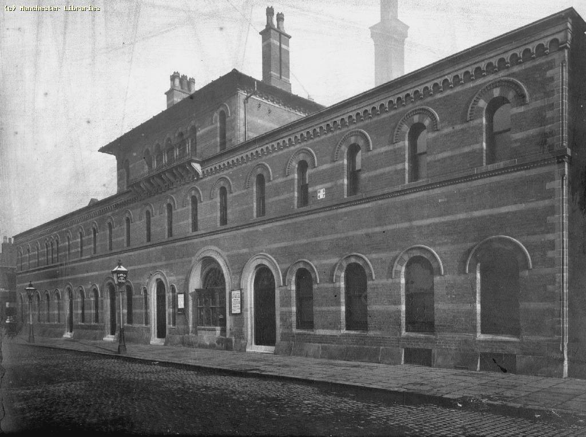
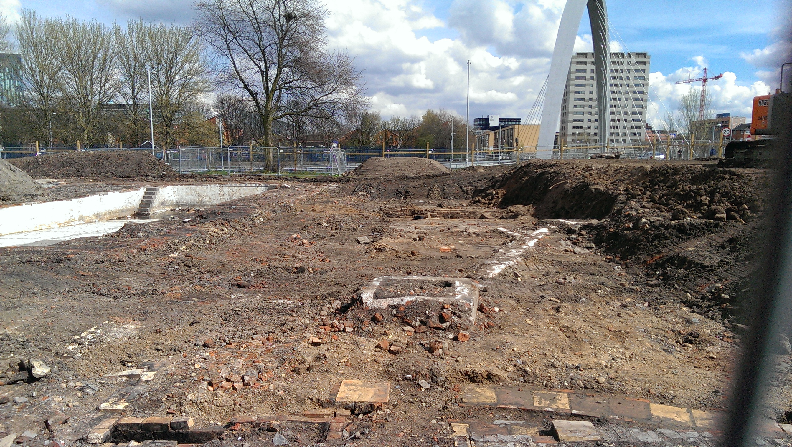
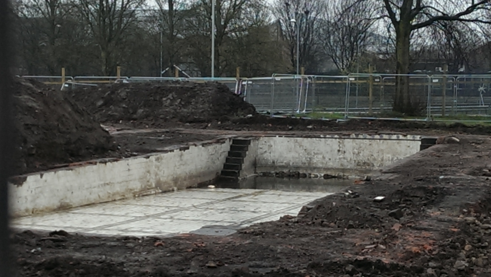
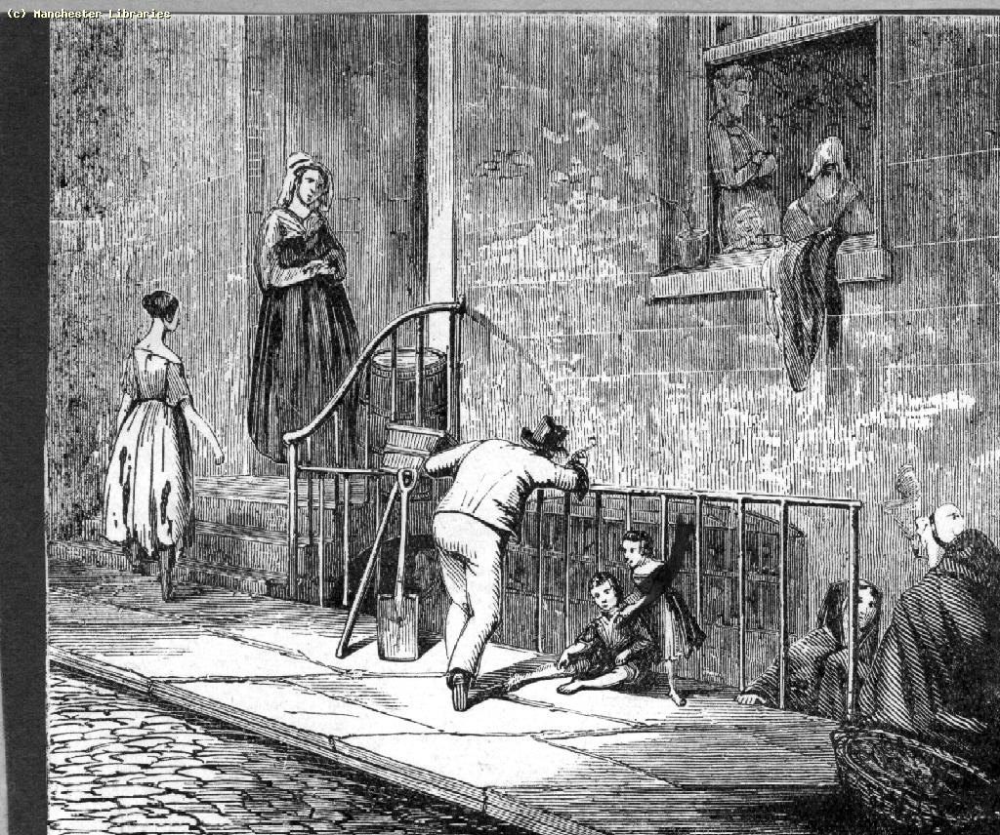
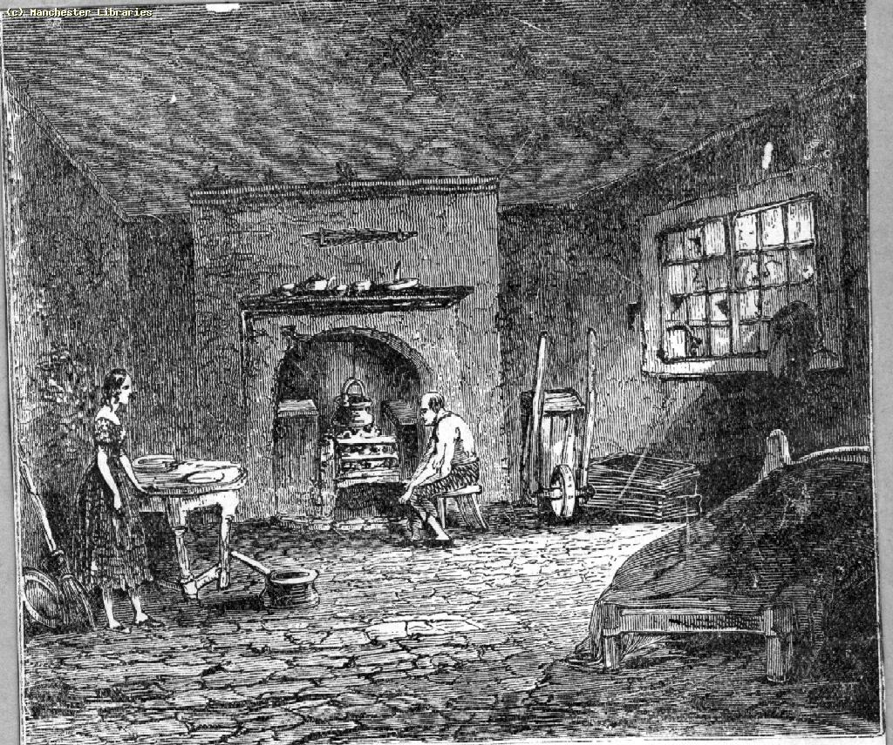
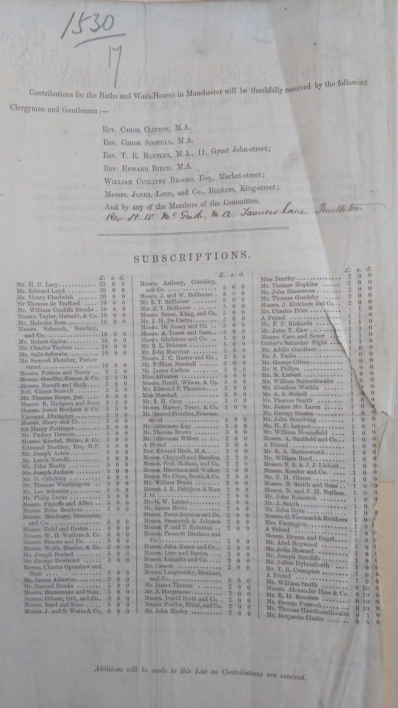

Manchester's pivotal role in the industrial revolution has been written about extensively -- what can we possibly learn from the baths and wash-houses of the time that we don't know already? In this article, I propose that this one small aspect of life in Manchester in the 1840s gives a crucial insight into people's lives and experiences, and the beginning of Manchester's perception of itself as a modern city. People needed to wash and bathe and clean their clothes, and it was much harder to do so before public baths were established. Even after the establishment of the Manchester and Salford Baths and Laundries Company, it was a luxury that few could afford.

I have been researching Manchester's public baths since before the Hulme History Project, and became fascinated with Leaf Street Baths and Wash-houses. This gigantic municipal baths was round the corner from my house, and now there is almost no trace of either its existence or impact on the community -- the site was a park, and is currently being redeveloped into flats.

I fell down the proverbial rabbit hole imagining Hulme at the time, what it looked and smelt like and how people lived. But why should anyone else care?

Well. There are a number of reasons that make public baths and wash-houses interesting as yardsticks of social progress. I'll talk about my main four here: habitus, civil engineering, finance, and municipal government.

**Habitus**. What's considered "normal" living conditions? Habitus explores how different kinds of people lived in Manchester, why they lived that way, and what they thought about it. Bath-houses transformed what people considered acceptable, expedited through Victorian Christian morals about "cleanliness being close to godliness".

**Civil engineering**. Public baths are only a part of the massive civil engineering project that is an industrial city. But they are good way to understand how civil engineering as a discipline emerged, and how it was promoted by town planners, engineers, business men, and politicians. Civil engineering in Manchester at the time was about railways, roads and trade; the baths were one of the first things built explicitly for the poor.

**Finance**. In order for public baths to be built and run, funds need to be raised -- almost entirely through public subscription. Modern crowd-funding like Kickstarter utterly pales in comparison to 19th century public philanthropy. The methods this was accomplished with give a crucial insight into how some aspects of the country were run in the early Victorian period.

**Municipal government**. Manchester's early baths and wash-houses were built by private enterprise, and the municipal government lagged behind its regional neighbours by not getting involved until 1876. Looking at how the municipal government changed lets us understand why the Corporation may have been so reluctant to take on public bathing, and what they were focusing their energies on instead: roads, railways, sewage, and waterworks.

## Habitus

Habitus is a concept commonly used in sociology when understanding what's considered "normal," especially the kind of normal we take for granted.

Habitus explores how we understand the world: that we wear specific kinds of clothes; accept some things as food items and not others; talk in a specific way in certain situations; build and decorate our homes in a certain way. The concept addresses "things that go without saying" -- elements we only notice when absent. Houses represent normalized spatial arrangements and conveniences accepted across communities.

Manchester in the middle of the 19th century was a study in contrasts: there was excruciating poverty next to splendid factories and mills. Much of the middle class of merchants and wealthy people had moved out of the city centre toward leafy Moss Side and other surrounding suburbs to escape the filth and the mess. Focus here centers on the living conditions of the poor because they were the ones the baths and wash-houses were intended for and the ones who used them. Many middle class houses would have access to water and thus cleaning and washing facilities that poor households lacked.

To be honest, people were not living exactly like this: it was much, much worse. There were often up to a dozen people crammed into a room like the one above, sleeping on rags, straw, each other, anything they could find. Often, there would be no furniture at all and the floor would be damp. There would be children and adults with hardly any clothes because they had been pawned for food all on top of each other in a cellar room with no windows. In some parts of Manchester, especially Little Ireland or Gibraltar, the floor would be flooded with river water almost all the time.

Housing represents something taken for granted; we need shelter, sustenance, and warmth. However, perspectives on housing and living conditions have shifted markedly across 170 years. Contemporary society views housing as a right with expected comfort standards. This wasn't reality in 1840s Manchester unless you belonged to a social class not living hand-to-mouth. Most of the new population of industrial Manchester lived in dire poverty, especially the hand loom weavers who were rapidly put out of business by power loom advancements.

Manchester's population had exploded over the previous twenty years. Jerry-built slum housing and property speculation were rife, and created a physical situation for the residents that is almost unimaginable to us now. Considering not only the physical conditions, but also the habits, expectations, and culture accompanying them illustrates habitus fundamentally. Documentation exists regarding what slum residents ate and drank, what they wore, what they did in their extremely limited free time.

Depending on their social status, they would be eating gruel (though probably without milk, just mixed with water) or potatoes, or bread if there was bread to be had. If they were unemployed it was likely that they would not eat at all and depend entirely on their neighbours or the outdoor relief the parish was providing which usually contained of soup and a little bread. Poor people in Manchester in the 1840s would be drinking water from the few public taps, or from the polluted rivers and brooks. If they had the money for it, they would drink ale. In their free time, if they were in work, they might go to church, or spend time with friends and family, usually in beer houses. Social reformers were very much concerned with the intemperance of the people.

Bathing and washing are completely normal to us in the global North now, and we take our daily showers and washing machines for granted. The fact that these are relatively new inventions and conveniences is not something many people think about, and it's hard to imagine living without them. When you attempt this imaginative exercise, the effect becomes somewhat alienating and fascinating: "looking through a stained glass window and everything being familiar but distorted, slightly off, and in strange colours."

Understanding Manchester's public baths provides insight into the terrible cost of wealth this city created: the fact that they needed to be built in the first place and the manifold motives of those who built them create a picture of life in early Victorian Manchester. Cholera had spread through the city in 1832, with outbreaks of typhus and smallpox to follow. Most of the habitations of the working classes could be considered uninhabitable, let alone insanitary, and disease was rife. Life expectancy in Manchester for a working class person in 1842 was 16 years. It was not only that disease and malnutrition claimed many lives, accidents in the mills and factories happened all the time and children as young as four would work on the factory floor. At the time, this was just how things were and many poor people seemingly expected nothing else. But even at the time, reports were being written about the conditions of the labouring population and how they could be relieved of some of their suffering.

Public baths and wash-houses were only a small part in this nation-wide project and there are many arguments about how to interpret the motives of the philanthropists who set up the early baths and wash-houses in Manchester. Some argue that it was out of self-interest: to ensure that the cogs of the machines keep running, they need to be operated by clean, sober, and obedient workers. Some argue that it was out of Christian Humanitarianism, a need to help the suffering fellow man. Still others argue that death and disease were bad for business and stood in the way of man's economic efforts in a laissez faire economy. The motivations likely combined all three, though that question remains secondary here.

Much of what was said at the time of the opening of Manchester's first public baths and wash-house focussed on the health and the moral argument: "being clean on the outside also meant that you were cleaner on the inside. Cleanliness is next to godliness."

So what needed to happen for baths to be built?

## Engineering

Civil engineering as we understand it today was in its infancy at this time. While the Institution of Civil Engineers was founded in London in 1818, until the start of the Industrial Revolution the massive projects we associate the profession with today were not possible or necessary.

In Manchester, as all over the North and the rest of the country, civil engineers were concerned with railways, bridge and canal building as well as the construction, paving, and widening of roads. From the 1840s onwards, the profession grew rapidly. So did the expertise of the engineers, which is why by the 1890s Manchester had its very own ship canal and was the third largest sea port in the country.

Nevertheless, public baths and water supply were not really on the agenda until after the 1848 Public Health Act, which was intended to ensure that towns and populous districts improved living conditions when it came to sanitation, drainage and water supply.

The water for baths and other sanitation projects needed to come from somewhere, and it took a while for Manchester to be connected to the grid, if you like. Early baths, such as the one on Miller Street (opened 1846) and the one on Sycamore Street (opened 1850) used the water they got from local springs to fill up cisterns. This was not very reliable and the water pressure was temperamental, to say the least. Factories were built everywhere and steam power made mechanisation more and more advanced. Very similar to today, many engineering projects relied on engineers with imagination and gumption to try things out.

And, of course, information sharing. No-one knew how to build a bath house for a large number of people. Sure, some wealthier families had bathing facilities in their houses, and the Manchester Infirmary had a few slipper baths but not on the scale that is needed to clean an industrial population. Liverpool opened the first public baths in the country (in 1832), but it were the London experimental establishments that drew up the plans on how to build a public baths and wash-house from scratch.

Reports documented how to build baths and wash-houses for engineers with no prior experience in such projects. Plans existed for a variety of budgets. One notable example designed a model establishment to the cost of £4000 and was taken from 1852's Report on Baths and Wash-Houses for the Labouring Classes in London. Multiple plans addressed other price categories and sizes. These model facilities included plunge pools, smaller cousins of modern swimming pools. Pumping and safely storing that much water into a pool required considerable civil engineering infrastructure.

Interest in these reports stems from multiple factors. Obviously, clean water was essential for bathing and washing clothes, but the reports also reveal how people conceptualized the problem of bathing and washing. Water supply to Manchester itself merited attention. This was achieved by connecting the town to the Longdendale Reservoir in 1860, after ten years of engineering works and improvements. The stretch looked like this in 1881:

Manchester still gets its water from this connection today.

## Finance

The next question is, of course, who paid for all of this massive engineering? These days, most swimming pools are built and maintained by the local authority. 170 years ago that was not the case. So how did the early baths come about? The easy answer is that committees were established to open them. People who got together, raised funds, found a suitable venue, converted it, and opened the baths. This represented 19th century crowd funding.

It was a bit more complicated than that though; most baths used a subscription model, somewhere between a share and a donation, as far as can be determined. All of the early baths and wash-houses discovered in Manchester (including the Manchester and Salford Baths and Laundries Company) were run on this model. A committee would be set up and go about convincing people to donate money to the cause. This model was definitively not only applied to baths: the first public parks in Manchester and Salford were financed the same way. This results in subscriber lists such as:

The amounts given range from £25 to 5s. What subscribers received in return remains unclear. Normally, subscriptions apply to newspapers and magazines where recipients obviously get the publication for their money, but here? Because the funds are being raised for a public bath it would not make sense to restrict entrance to the subscribers either. Perhaps "subscription" represents shares and the "investors" would receive a share of profits proportional to their investments. Perhaps. This model persisted until 1876 when Manchester Corporation took over due to massive losses, including the price of coal exploding -- a story for another time.

## Municipal Government

What does the history of public baths in Manchester reveal about the development and administration of the municipal corporation? The answer: quite a lot, actually.

The first five public baths in Manchester were in private hands and the first 30 years of public bathing, washing, and swimming were administered either by private committees or by a company. Why was this? It had a lot to do with the administration of a growing industrial city which was going through significant administrative changes in those 30 years. It had to do with how the municipality was financed, and what it was spending money on. It had even more to do with what the Corporation was for, and what its duties and responsibilities were.

Contemporary society doesn't question that the City Council manages a large part of urban conveniences, from road management, to bin collections, to school provision and playgrounds. All of these responsibilities had to be bestowed to the Corporation or had to be taken on by them. All those decisions remain political and were fought over vigorously in the local committees, council chambers and meeting rooms.

From 1838 (when Manchester was first incorporated) to 1851 (when it received city status) to 1876 (when the Corporation took over baths and wash-houses), these duties and responsibilities were negotiated and renegotiated until achieving a situation of municipal governance and finance more recognizable today.

Initially, Manchester Corporation focussed on improving sanitation by removing nuisances (such a beautiful word to obscure overflown privies and ash heaps), draining and paving streets, and improving the water supply to the city. Much of this was achieved through local legislation which sometimes lacked teeth and often did not compel landlords to build more privies or improve their houses. There was also vicious obstruction from the Manchester "Shopocrats" to contend with who resented administrative meddling with the market's abilities to fix everything, including social problems, through private enterprise.

Taking on responsibilities like roads and encroaching little by little into mill owners' territory when it came to working conditions and hours, Manchester Corporation eventually was in a position to put the Baths and Wash-Houses Act 1876 into practice and build its own municipal baths.

Of course, there was national and local legislation and its implementation to take into account as well and that is a whole different story.

## Conclusion

Investigating early baths and wash-houses opens a multifaceted and complex window into the past definitely worth examining. These facilities don't stand in isolation; studying them enables exploration of other aspects of 19th century industrial life, such as living conditions, engineering advances, financing strategies, and municipal governance. Other aspects merit examination, though these represent current areas of focus.
