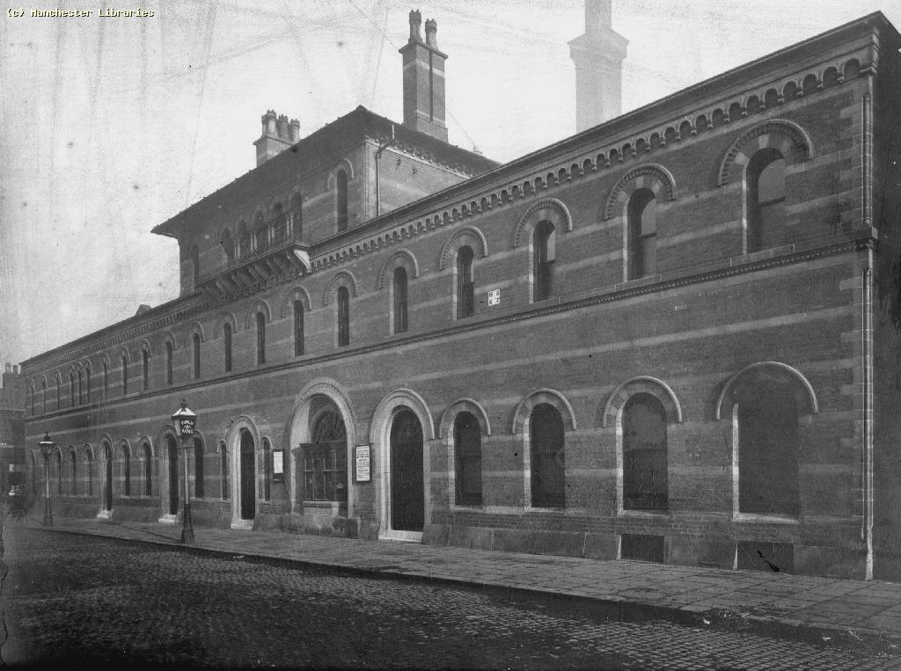
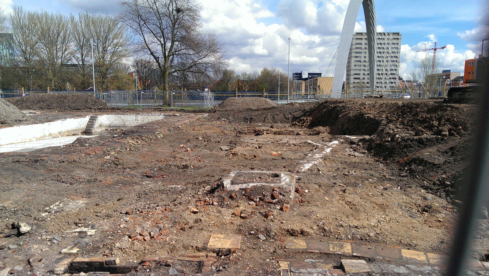
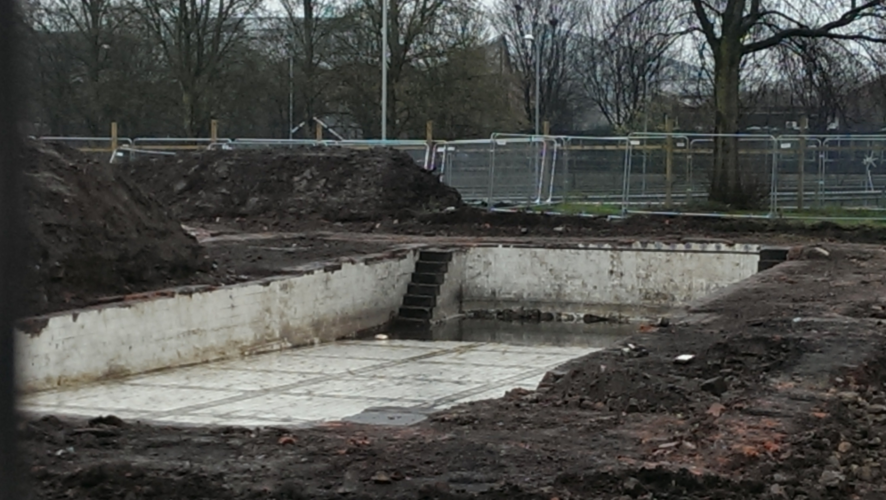
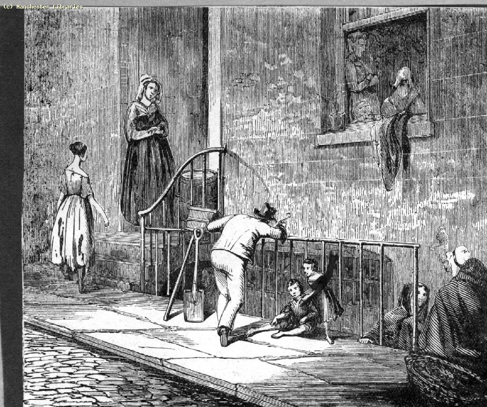
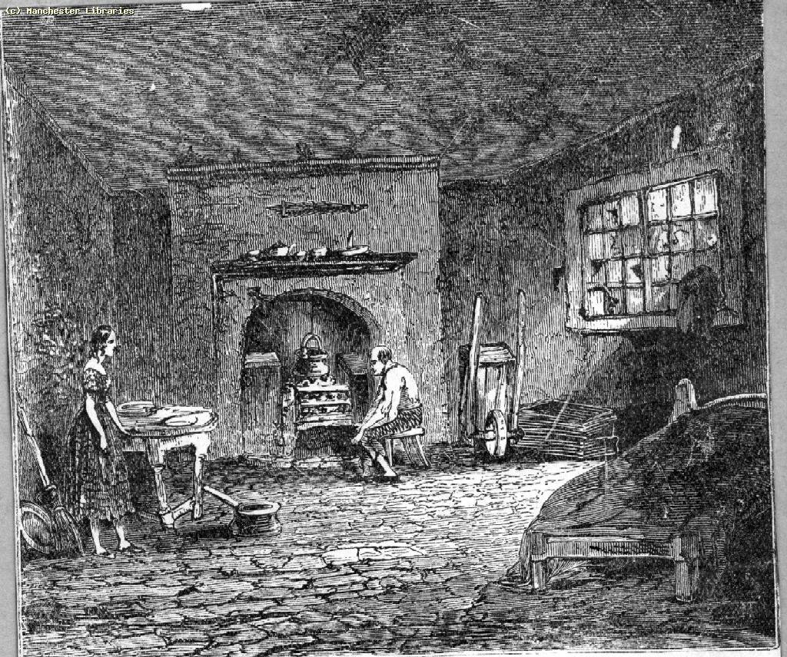
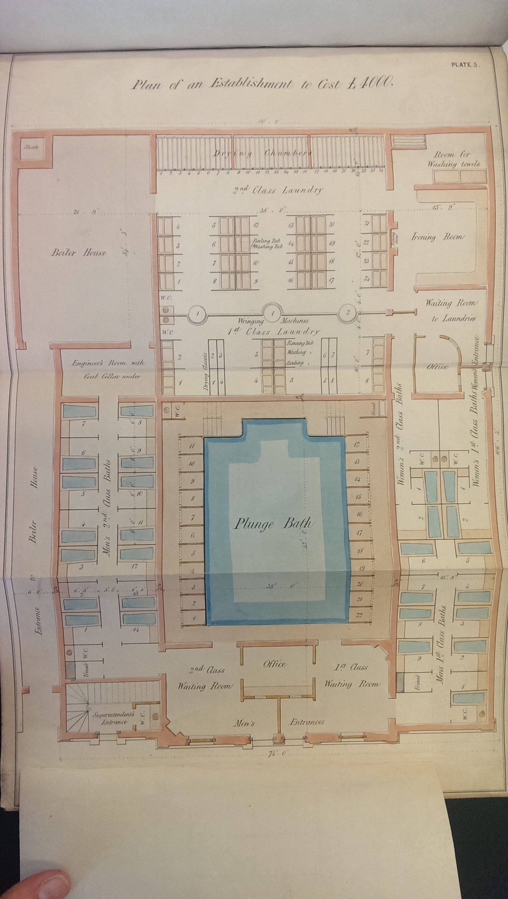
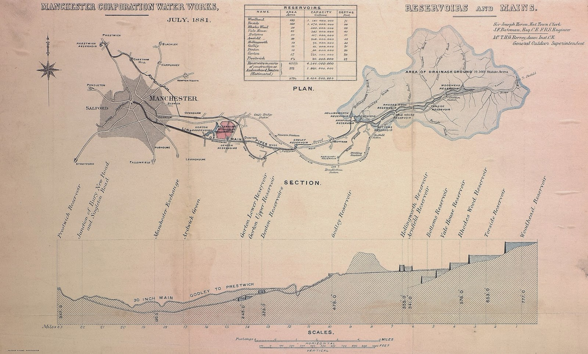
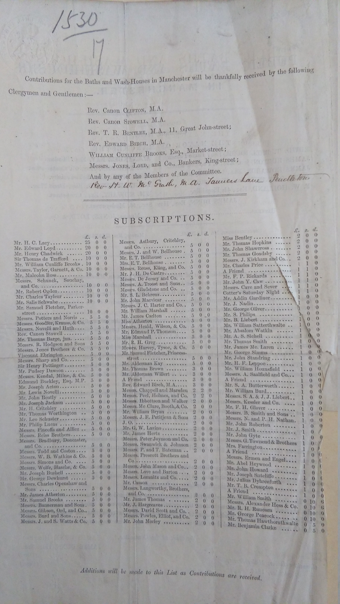

Manchester's pivotal role in the industrial revolution has been written about extensively -- what can we possibly learn from the baths and wash-houses of the time that we don't know already? In this article, I propose that this one small aspect of life in Manchester in the 1840s gives a crucial insight into people's lives and experiences, and the beginning of Manchester's perception of itself as a modern city. People needed to wash and bathe and clean their clothes, and it was much harder to do so before public baths were established. Even after the establishment of the _Manchester and Salford Baths and Laundries Company_, it was a luxury that few could afford. But I'm getting ahead of myself.

I have been researching Manchester's public baths since before the [Hulme History Project](http://hulmehistory.info/), and became fascinated with Leaf Street Baths and Wash-houses. This gigantic municipal baths was round the corner from my house, and now there is almost no trace of either its existence or impact on the community -- the site was a park, and is currently being redeveloped into flats.

In its heyday it looked like this:

The last time I got a good look at the site before it was all boarded up, it looked like this:

The beautiful second class males swimming pool cracked and full of dirty water:

I fell down the proverbial rabbit hole imagining Hulme at the time, what it looked and smelt like and how people lived. But why should anyone else care?

Well. There are a number of reasons that make public baths and wash-houses interesting as yardsticks of social progress. I'll talk about my main four here: habitus, civil engineering, finance, and municipal government.

**Habitus**. What's considered "normal" living conditions? Habitus explores how different kinds of people lived in Manchester, why they lived that way, and what they thought about it. Bath-houses transformed what people considered acceptable, expedited through Victorian Christian morals about "cleanliness being close to godliness".

**Civil engineering**. Public baths are only a part of the massive civil engineering project that is an industrial city. But they are good way to understand how civil engineering as a discipline emerged, and how it was promoted by town planners, engineers, business men, and politicians. Civil engineering in Manchester at the time was about railways, roads and trade; the baths were one of the first things built explicitly for the poor.

**Finance**. In order for public baths to be built and run, funds need to be raised -- almost entirely through public subscription. Modern crowd-funding like Kickstarter utterly pales in comparison to 19th century public philanthropy. The methods this was accomplished with give a crucial insight into how some aspects of the country were run in the early Victorian period.

**Municipal government**. Manchester's early baths and wash-houses were built by private enterprise, and the municipal government lagged behind its regional neighbours by not getting involved until 1876. Looking at how the municipal government changed lets us understand why the Corporation may have been so reluctant to take on public bathing, and what they were focusing their energies on instead: roads, railways, sewage, and waterworks.

### Habitus

[Habitus](https://en.wikipedia.org/wiki/Habitus_\(sociology\)) is a concept commonly used in sociology when understanding what's considered "normal," especially the kind of normal we take for granted.

Habitus explores how we understand the world: that we wear specific kinds of clothes; accept some things as food items and not others; talk in a specific way in certain situations; build and decorate our homes in a certain way. I don't mean that some people prefer green wallpaper over purple; I mean that we accept that houses look a certain way, that they have conveniences in them and are laid out in a way that we are used to. Habitus explores the things that "go without saying," the things that only when they are absent strike us as missing.

Manchester in the middle of the 19th century was a study in contrasts: there was excruciating poverty next to splendid factories and mills. Much of the middle class of merchants and wealthy people had moved out of the city centre toward leafy Moss Side and other surrounding suburbs to escape the filth and the mess. I am concerned here with the living conditions of the poor because they were the ones the baths and wash-houses were intended for and the ones who used them. Many middle class houses would have access to water and thus cleaning and washing facilities that poor households lacked.

Here's what houses for the poor in Manchester looked like at the time. This is a common illustration of the outside of a cellar dwelling from 1838. Interestingly, there were few streets in the slums of the poor that would have been paved at this time.

Here's the interior. Note the apparent high ceiling and abundance of furniture in this picture.

To be honest, people were not living exactly like this: it was much, much worse. There were often up to a dozen people crammed into a room like the one above, sleeping on rags, straw, each other, anything they could find. Often, there would be no furniture at all and the floor would be damp. There would be children and adults with hardly any clothes because they had been pawned for food all on top of each other in a cellar room with no windows. In some parts of Manchester, especially Little Ireland or Gibraltar, the floor would be flooded with river water almost all the time.

Housing is one of those things that "go without saying"; we need shelter, sustenance, and warmth. But how we think about housing and living conditions has changed somewhat over the last 170 years. To us today, housing is a right, and we expect a certain level of comfort. This was only the case in 1840s Manchester if you were of a social class that did not live hand-to-mouth. Most of the new population of industrial Manchester lived in dire poverty, especially the hand loom weavers who were rapidly put out of business by the advancements of the power looms.

Manchester's population had exploded over the previous twenty years. Jerry-built slum housing and property speculation were rife, and created a physical situation for the residents that is almost unimaginable to us now. To think not only of the physical conditions, but also the habits, expectations, and culture that go with it is habitus in a nutshell. We know for example, what the people living and working in the slums around the cotton mills ate and drank, what they wore, what they did in the extremely limited free time they had.

Depending on their social status, they would be eating [gruel](https://en.wikipedia.org/wiki/Gruel) (though probably without milk, just mixed with water) or potatoes, or bread if there was bread to be had. If they were unemployed it was likely that they would not eat at all and depend entirely on their neighbours or the outdoor relief the parish was providing which usually contained of soup and a little bread. Poor people in Manchester in the 1840s would be drinking water from the few public taps, or from the polluted rivers and brooks. If they had the money for it, they would drink ale. In their free time, if they were in work, they might go to church, or spend time with friends and family, usually in beer houses. Social reformers were very much concerned with the intemperance of the people.

Bathing and washing are completely normal to us in the global North now, and we take our daily showers and washing machines for granted. The fact that these are relatively new inventions and conveniences is not something many people think about, and it's hard to imagine living without them. The effect when you do is somewhat alienating, and fascinating: looking through a stained glass window and everything being familiar but distorted, slightly off, and in strange colours.

Knowing about Manchester's public baths gives an insight into the terrible cost of the wealth this city created: the fact that they needed to be built in the first place and the manifold motives of those who built them create a picture of life in early Victorian Manchester. Cholera had spread through the city in 1832, with outbreaks of typhus and smallpox to follow. Most of the habitations of the working classes could be considered uninhabitable, let alone insanitary, and disease was rife. Life expectancy in Manchester for a working class person in 1842 was 16 years. It was not only that disease and malnutrition claimed many lives, accidents in the mills and factories happened all the time and children as young as four would work on the factory floor. At the time, this was just how things were and many poor people seemingly expected nothing else. But even at the time, reports were being written about the conditions of the labouring population and how they could be relieved of some of their suffering.

Public baths and wash-houses were only a small part in this nation-wide project and there are many arguments about how to interpret the motives of the philanthropists who set up the early baths and wash-houses in Manchester. Some argue that it was out of self-interest: to ensure that the cogs of the machines keep running, they need to be operated by clean, sober, and obedient workers. Some argue that it was out of Christian Humanitarianism, a need to help the suffering fellow man. Still others argue that death and disease were bad for business and stood in the way of man's economic efforts in a _laissez faire_ economy. I suspect that it was a mixture of all three but for now that is beside the point.

Much of what was said at the time of the opening of Manchester's first public baths and wash-house focussed on the health and the moral argument: being clean on the outside also meant that you were cleaner on the inside. Cleanliness is next to godliness, indeed.

So what needed to happen for baths to be built?

### Engineering

Civil engineering as we understand it today was in its infancy at this time. While the _Institution of Civil Engineers_ was founded in London in 1818, until the start of the Industrial Revolution the massive projects we associate the profession with today were not possible or necessary.

In Manchester, as all over the North and the rest of the country, civil engineers were concerned with railways, bridge and canal building as well as the construction, paving, and widening of roads. From the 1840s onwards, the profession grew rapidly. So did the expertise of the engineers, which is why by the 1890s Manchester had its very own ship canal and was the third largest sea port in the country.

Nevertheless, public baths and water supply were not really on the agenda until after the 1848 Public Health Act, which was intended to ensure that towns and populous districts improved living conditions when it came to sanitation, drainage and water supply.

The water for baths and other sanitation projects needed to come from somewhere, and it took a while for Manchester to be connected to the grid, if you like. Early baths, such as the one on Miller Street (opened 1846) and the one on Sycamore Street (opened 1850) used the water they got from local springs to fill up cisterns. This was not very reliable and the water pressure was temperamental, to say the least. Factories were built everywhere and steam power made mechanisation more and more advanced. Very similar to today, many engineering projects relied on engineers with imagination and gumption to try things out.

And, of course, information sharing. No-one knew how to build a bath house for a large number of people. Sure, some wealthier families had bathing facilities in their houses, and the Manchester Infirmary had a few slipper baths but not on the scale that is needed to clean an industrial population. Liverpool opened the first public baths in the country (in 1832), but it were the London experimental establishments that drew up the plans on how to build a public baths and wash-house from scratch.

We have reports on how to build baths and wash-houses to be read by engineers who had no idea how to do this. There are plans for a variety of budgets. The one below is for a model establishment to the cost of £4000 and taken from 1852's _Report on Baths and Wash-Houses for the Labouring Classes in London_. There are more plans for other price categories and sizes. These model baths and wash-houses included plunge pools, the smaller cousin of the swimming pools we are used to today. For that much water to be pumped and stored safely into a pool required a lot of civil engineering works.

I am interested in this because obviously one needs clean water to bathe and wash clothes, but also because the reports give us an insight into how people thought about the problem of bathing and washing. There is, of course, also the question of water supply to Manchester. This was achieved by connecting up the town to the Longdendale Reservoir in 1860, after ten years of engineering works and improvements. The stretch looked like this in 1881:

Manchester still gets its water from this connection today.

### Finance

The next question is, of course, who paid for all of this massive engineering? These days, most swimming pools are built and maintained by the local authority. 170 years ago that was not the case. So how did the early baths come about? The easy answer is that committees were established to open them. People who got together, raised funds, found a suitable venue, converted it, and opened the baths. 19th century crowd funding.

It was a bit more complicated than that though; most baths used a subscription model, somewhere between a share and a donation, as far as I can figure out. All of the early baths and wash-houses I have found in Manchester (including the Manchester and Salford Baths and Laundries Company) were run on this model. A committee would be set up and go about convincing people to donate money to the cause. It was definitively not only baths that this model was applied to: the first public parks in Manchester and Salford were financed the same way. You end up with a subscriber list similar to this one:

The amounts given range from £25 to 5s. I'm not sure exactly what you got in return for the subscription. Normally, subscriptions are used by newspapers and magazines and you would obviously get the newspaper or magazine for your money but here? Because the funds are being raised for a _public_ bath it would not make sense to restrict entrance to the subscribers either. Perhaps "subscription" is just another word for shares and in this case the "investors" would obviously receive a share of the profit in line with their investments. Perhaps. This model persisted until 1876 when Manchester Corporation took over due to massive losses, including the price of coal exploding -- a story for another time.

Speaking of Manchester Corporation...

### Municipal Government

What does the history of public baths in Manchester tell us about the development and administration of the municipal corporation? Short answer: quite a lot, actually.

The first five public baths in Manchester were in private hands and the first 30 years of public bathing, washing, and swimming were administered either by private committees or by a company. Why was this? It had a lot to do with the administration of a growing industrial city which was going through significant administrative changes in those 30 years. It had to do with how the municipality was financed, and what it was spending money on. It had even more to do with what the Corporation was for, and what its duties and responsibilities were.

We do not even question today that the City Council is responsible for a large part of our conveniences, from road management, to bin collections, to the provision of schools, playgrounds, parks. All of these responsibilities had to be bestowed to the Corporation or had to be take on by them. And all those decisions are political and were fought over tooth and nail in the local committees, council chambers and meeting rooms.

From 1838 (when Manchester was first incorporated) to 1851 (when it received city status) to 1876 (when the Corporation took over the provision of baths and wash-houses), these duties and responsibilities were negotiated and renegotiated until we get to a situation of municipal governance and finance we are more familiar with.

Initially, Manchester Corporation focussed on improving sanitation by removing nuisances (such a beautiful word to obscure overflown privies and ash heaps), draining and paving streets, and improving the water supply to the city. Much of this was achieved through local legislation which sometimes lacked teeth and often did not compel landlords to build more privies or improve their houses. There was also vicious obstruction from the Manchester "Shopocrats" to contend with who resented administrative meddling with the market's abilities to fix everything, including social problems, through private enterprise.

Taking on responsibilities like roads and encroaching little by little into mill owners' territory when it came to working conditions and hours, Manchester Corporation eventually was in a position to put the Baths and Wash-Houses Act 1876 into practice and build its own municipal baths.

Of course, there was national and local legislation and its implementation to take into account as well and that is a whole different story.

### Conclusion

So, as can be seen, investigating early baths and wash-houses opens a window into the past that is multifaceted and complex and definitively worth doing!

Baths and Wash-houses do not stand in isolation and studying them lets us explore other aspects of 19th century industrial life, such as living conditions, engineering advances, financing strategies, and municipal governance. There are, of course, other aspects that these fascinating institutions let us examine but these are the ones I am interested in at the moment.
